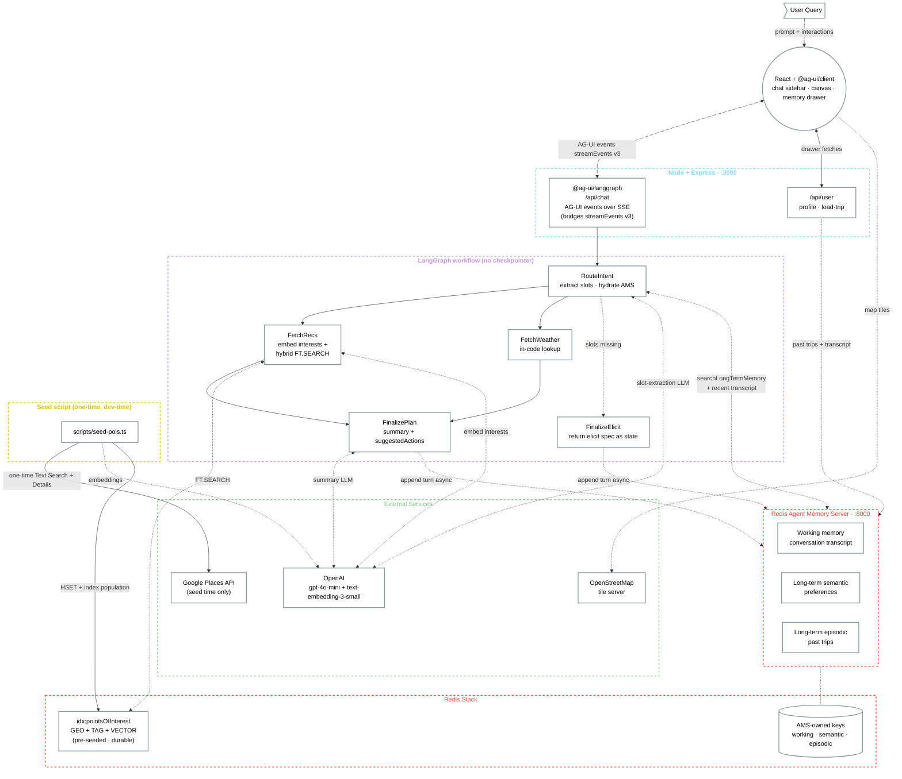

# 01 — System Architecture

Block diagram of the Trip Itinerary Builder. Shows the user, the React + `@ag-ui/client` frontend (sidebar chat + canvas + memory drawer), the Node + Express backend with `@ag-ui/langgraph` bridging to the LangGraph workflow, the single LangGraph workflow (five nodes, no checkpointer), Redis (POI hybrid index + Agent Memory Server storage), and the external services. The seed script is shown separately — it's a one-time dev-time tool, not a runtime path.

### What the request flow shows

1. **Frontend → `@ag-ui/langgraph` bridge.** The React client (via `@ag-ui/client`'s `HttpAgent.runAgent`) sends turn requests over AG-UI; `@ag-ui/langgraph` subscribes to `streamEvents({ version: "v3" })` from the LangGraph workflow and forwards each event as an AG-UI event over SSE (`RUN_STARTED`, `STEP_STARTED`/`STEP_FINISHED` per node, `STATE_DELTA`, `RUN_FINISHED`).
2. **RouteIntent.** Hydrates `state.preferences` from AMS (long-term semantic + recent working memory); calls OpenAI for slot extraction over the user's message.
3. **Conditional edge.** Branches based on whether required slots (`destination`, `dates`) are filled. If missing → `FinalizeElicit`. If present → `[FetchRecs, FetchWeather]` in parallel.
4. **FetchRecs.** Embeds `state.interests` with `text-embedding-3-small`; runs hybrid `FT.SEARCH idx:pointsOfInterest` (city TAG filter AND KNN over the interests vector) in one Redis round-trip.
5. **FetchWeather.** Synchronous in-code lookup against the city/month JS object — no API call.
6. **FinalizePlan.** Calls OpenAI for the summary text, populates `state.suggestedActions[]` for the follow-up chips, and fires `appendToWorkingMemory(turn)` to AMS asynchronously.
7. **FinalizeElicit.** Returns `{ elicit: { message, requestedSchema } }` as the graph's final state. The client renders a chip card and resubmits a new turn with the merged state — no pause/resume, no checkpointer.

### The two faces of Redis

This demo uses Redis Stack in **two ways**, on the same instance:

- **Hybrid POI index** (`idx:pointsOfInterest`) — GEO + TAG + VECTOR fields on the same hash records, populated once by `scripts/seed-pois.ts`. Every runtime read is a single `FT.SEARCH` — city TAG filter AND KNN over the interests embedding — in one round-trip. No TTL; re-run the seed script to refresh.
- **Agent Memory Server backing store** — AMS is a separate service with its own REST API, but it persists to the same Redis. AMS owns three tiers: working memory (conversation transcripts), long-term semantic (preferences), and long-term episodic (past trips).

### What's *not* shown (intentionally)

- **AG-UI SDK internals** — `@ag-ui/client`'s `HttpAgent` + `AgentSubscriber` and `@ag-ui/langgraph`'s LangGraph→AG-UI translation are abstracted into the "Frontend" and "@ag-ui/langgraph" nodes respectively.
- **State transitions inside `FetchRecs`** — the embed + `FT.SEARCH` + rank pipeline is in `03-langgraph-workflows.md`.
- **LangCache** — explicitly skipped for this iteration. Performance pattern uses the parallel `FetchRecs ∥ FetchWeather` fan-out + Redis hybrid index instead.
