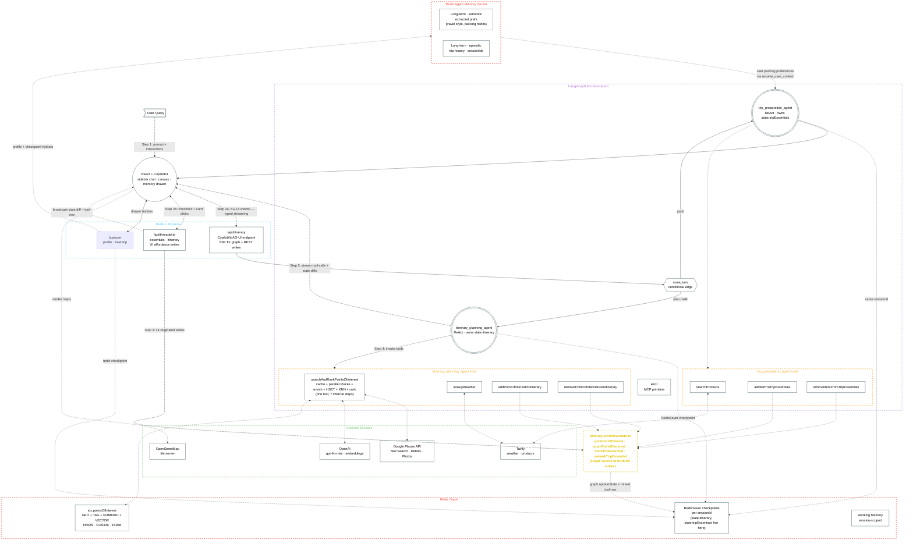

# 01 — System Architecture

Block diagram of the Trip Itinerary Builder. Shows the user, the React + CopilotKit frontend (sidebar chat + canvas + memory drawer), the Node + Express backend, the single LangGraph topology with two ReAct agents (`itinerary_planning_agent`, `trip_preparation_agent`) and a router, the agent tool layer, the shared mutation helpers in `itinerary-workflow/state.ts` that bridge agent tools and REST handlers, the Redis hybrid index + Agent Memory Server, and the external APIs. Mirrors the redish `architecture-diagram.md` style.

Two sections below — **v1** captures the original CopilotKit v1 setup (single Node process, GraphQL-bridged runtime). **v2** captures the current setup after the migration to CopilotKit v2 (native AG-UI / SSE runtime, two-process topology with a separate `langgraphjs dev` host). The downstream graph topology, tools, Redis hybrid index and Agent Memory Server are identical in both — only the transport and runtime hosting changed.

## v1 — CopilotKit v1 runtime (single-process · GraphQL bridge)

### What the steps show

1. **Step 1** — User interacts with the React + CopilotKit frontend: types prompts in the sidebar chat, fills inline chips, checks point-of-interest cards on the canvas, toggles essential checkboxes, and opens the memory drawer from the hamburger.
2. **Step 2a** — Chat messages flow over AG-UI (typed, bi-directional streams) into `/api/itinerary`, then into the graph router.
3. **Step 2b** — Direct UI affordances (point-of-interest add/remove, essential checkboxes) hit dedicated REST endpoints under `/api/threads/:id`. Same channel back via SSE.
4. **Step 3** — UI-originated writes funnel through the mutation helpers in `itinerary-workflow/state.ts` — the same module the agent tools import. One write path means no drift between chat-driven and UI-driven mutations.
5. **Step 4** — The active agent invokes tools from its own bound set. The planning agent calls into `PlanningTools` (`addPointOfInterestToItinerary`, `removePointOfInterestFromItinerary` mutate state; `searchAndRankPointsOfInterest`, `lookupWeather` are reads). The prep agent calls into `PrepTools` (`addItemToTripEssentials`, `removeItemFromTripEssentials` mutate state; `searchProducts` is a read). All mutation tools route through the helpers in `itinerary-workflow/state.ts`.
6. **Step 5** — Updates stream back to the frontend: agent tool-calls + state diffs over the AG-UI SSE; REST-originated writes get broadcast as tool-row thread entries on the same channel. Either way, both surfaces converge on the same state.

### The Redis triple play

This demo uses Redis Stack in **three distinct ways**, all in the same instance:

- **Hybrid points-of-interest index** (`idx:pointsOfInterest`) — GEO + TAG + NUMERIC + VECTOR fields. Every query is a single hybrid `FT.SEARCH` — GEO + TAG filters AND KNN over the interests embedding in one round-trip. The user's articulated interests just tighten or relax the cluster; there is no separate lexical path.
- **RedisSaver checkpoints** — LangGraph's working state per `sessionId`. This is where `state.itinerary` and `state.tripEssentials` live — full trip data per session. Powers the "load past trip" flow: the drawer fetches a checkpoint and rehydrates both the conversation and the canvas.
- **Agent Memory Server** — separate service, but same Redis underneath. Two-tier: working memory (session-scoped) and long-term (semantic + episodic, vector-searched cross-session). Long-term stores *extracted* preferences from past conversations (e.g., "user always packs a power bank") — not the trip data itself.

### What's *not* shown (intentionally)

- **CopilotKit internals** — packages like `@copilotkit/react-core` and `@copilotkit/react-ui` are abstracted into the "Frontend" node.
- **Agent ReAct loops** — the internal LLM ↔ ToolNode cycle inside each agent is in `03-langgraph-workflows.md`. The block here treats each agent as one orchestration unit.
- **The seven internal steps of `searchAndRankPointsOfInterest`** — cache check, parallel Places fetches, enrich + embed, HSET write, KNN, rank. Same file (`03-langgraph-workflows.md`) drills into this; here it's one tool box.
- **LangCache** — explicitly skipped for this iteration. Performance pattern uses parallel Places fan-out + the hybrid index cache instead.

## v2 — CopilotKit v2 runtime (two-process · native AG-UI / SSE)

Same downstream Redis hybrid index and Agent Memory Server as v1. What changed:

- **Graph collapsed to a single ReAct agent.** v1's topology — `resolve_user_context` → `route_turn` → `{elicit_missing_inputs → itinerary_planning_agent, trip_preparation_agent}` — was replaced by one `itinerary_agent` built with `createAgent` from `langchain` (see `server/src/modules/ai/itinerary-workflow/agents.ts`). Its 8 bound tools cover both planning and trip-prep. There is no router node, no separate elicit node, no resolve-context node, and no two-agent split.
- **Memory hints folded into the system prompt.** `dynamicSystemPromptMiddleware` reads recurring preferences from `getUserPreferences(userId)` (which sources from the Agent Memory Server) and appends a one-line `interests=…, budget=…` hint to the prompt on every invocation. The "memory before routing" v1 node is gone — there is no routing.
- **Elicitation is a tool, not a node.** `requestTripBasicsFromUser` is one of the eight tools; it calls `interrupt(elicit)` to pause the graph and surface a structured request to whichever client surface is driving the conversation. The agent calls it only when destination cannot be inferred from the conversation.
- The frontend now uses `@copilotkit/react-core` **v2** — the AG-UI client talks SSE directly to the runtime; the GraphQL bridge that v1 layered on top of the LangChain service adapter is gone.
- The Node backend is now **two processes**. Express on `:3000` hosts the CopilotKit v2 runtime (`CopilotRuntime` from `@copilotkit/runtime/v2`, mounted via `createCopilotEndpointExpress` at `/api/itinerary/copilotkit`) plus the existing REST routes. The compiled LangGraph runs in a separate `langgraphjs dev` process on `:8123`, registered as `itineraryPlanner` (see `server/langgraph.json` + the `dev:agent` npm script).
- The runtime's agent entry is `StreamModePinnedAgent` — a subclass of `LangGraphAgent` (`@copilotkit/runtime/langgraph`, which wraps `@ag-ui/langgraph`). It pins `streamMode` to `['messages-tuple', 'values', 'updates']` to bypass an `OnChatModelStream` bug in the `events` stream that drops `TOOL_CALL_START` events for the second tool call in an assistant message and concatenates argument chunks — see the inline comment in `server/src/index.ts`.
- `InMemoryAgentRunner` holds per-thread state inside the Express process (replay buffer, in-flight run bookkeeping). Across reloads it is fresh memory.
- Checkpointing is currently `MemorySaver` in both processes (`server/src/modules/ai/itinerary-workflow/helpers/checkpointer.ts`) — Redis-saver is paused pending `langchain-ai/langgraphjs#2334`. This means the langgraphjs-dev checkpoint (read by the agent) and the in-Express checkpoint (read by the REST mutation helpers via `getItineraryGraph().updateState`) are *separate* memory maps during local dev. The Redis hybrid index + Agent Memory Server are still shared and unchanged.

```mermaid
flowchart TD
    %% User Layer
    User>"User Query"]

    %% Frontend — CopilotKit v2 (AG-UI native client, no GraphQL)
    Frontend(("React + CopilotKit v2<br/>@copilotkit/react-core (AG-UI client)<br/>sidebar chat · canvas · memory drawer"))

    %% Backend — TWO Node processes
    subgraph ExpressProc["Node + Express  ·  :3000"]
        direction TB
        subgraph V2Runtime["CopilotKit v2 runtime"]
            direction TB
            EndpointAGUI["createCopilotEndpointExpress<br/>/api/itinerary/copilotkit<br/>(native AG-UI / SSE)"]
            Runner["InMemoryAgentRunner<br/>per-thread replay buffer +<br/>in-flight run state"]
            PinnedAgent["StreamModePinnedAgent : LangGraphAgent<br/>streamMode = ['messages-tuple',<br/>'values', 'updates']<br/>(see inline comment in index.ts)"]
        end
        ThreadRoutes2["/api/itinerary/:threadId<br/>essentials · entries<br/>UI affordance writes"]
        UserRoutes2["/api/user<br/>profile · load-trip"]
        InProcGraph["getItineraryGraph()<br/>in-process graph + MemorySaver<br/>(REST mutation path)"]
    end

    subgraph LangGraphDev["langgraphjs dev  ·  :8123"]
        direction TB
        GraphRuntime["LangGraph Platform API<br/>(threads · runs · streamMode)<br/>graphId = itineraryPlanner"]
        subgraph GraphTopology["itinerary-workflow graph"]
            direction TB
            ItinAgent((("itinerary_agent<br/>createAgent() ReAct loop<br/><i>single agent</i>")))
            SysPromptMw["dynamicSystemPromptMiddleware<br/>memory hint injected per turn"]
            subgraph BoundTools["Bound tools (8)"]
                direction LR
                ToolHITL["requestTripBasicsFromUser<br/>(interrupt() → elicit)"]
                ToolSearch["searchAndRankPointsOfInterest"]
                ToolWeather["lookupWeather"]
                ToolAddPoi["addPointOfInterestToItinerary"]
                ToolRmPoi["removePointOfInterestFromItinerary"]
                ToolProducts["searchProducts"]
                ToolAddEss["addItemToTripEssentials"]
                ToolRmEss["removeItemFromTripEssentials"]
            end
            ItinAgent -.- SysPromptMw
            ItinAgent -.->|tool calls| BoundTools
        end
        MemSaverDev["MemorySaver<br/>(Redis-saver paused pending<br/>langgraphjs#2334)"]
        GraphRuntime --> GraphTopology
        GraphTopology -.-> MemSaverDev
    end

    %% Shared mutation module + downstream layers (unchanged from v1)
    StateMut2["itinerary-workflow/state.ts<br/>pin · unpin · mark · unmark<br/>(graph.updateState via in-process graph)"]

    subgraph RedisStack2["Redis Stack  (shared, unchanged)"]
        PoiIndex2["idx:pointsOfInterest<br/>GEO + TAG + VECTOR"]
        WorkingMem2["Working Memory<br/>session-scoped"]
        CheckpointsPaused["RedisSaver checkpoints<br/>(paused — see note)"]
    end

    subgraph AMS2["Redis Agent Memory Server  (unchanged)"]
        LongTerm2["Long-term<br/>semantic + episodic"]
    end

    subgraph External2["External Services  (unchanged)"]
        OpenAI2["OpenAI"]
        Places2["Google Places"]
        Tavily2["Tavily"]
        OSM2["OpenStreetMap"]
    end

    %% Flow
    User -->|prompts + clicks| Frontend
    Frontend <-->|SSE · AG-UI events| EndpointAGUI
    Frontend <-->|REST: card / checkbox writes| ThreadRoutes2
    Frontend <-->|drawer fetches| UserRoutes2

    EndpointAGUI --> Runner
    Runner --> PinnedAgent
    PinnedAgent <-->|HTTP · LangGraph Platform API| GraphRuntime
    PinnedAgent -->|stream AG-UI events back| EndpointAGUI

    %% State writes — agent tools + REST both converge on state.ts
    ToolAddPoi -.-> StateMut2
    ToolRmPoi -.-> StateMut2
    ToolAddEss -.-> StateMut2
    ToolRmEss -.-> StateMut2
    ThreadRoutes2 -.->|UI-originated writes| StateMut2
    StateMut2 -.->|graph.updateState| InProcGraph
    InProcGraph -.-> CheckpointsPaused

    %% Tool → external service edges (collapsed)
    ToolSearch <-.-> Places2
    ToolSearch <-.-> OpenAI2
    ToolSearch <-.-> PoiIndex2
    ToolWeather <-.-> Tavily2
    ToolProducts <-.-> Tavily2

    %% Memory feed — AMS → system prompt middleware (not a graph node)
    AMS2 -.->|getUserPreferences<br/>recurring prefs| SysPromptMw
    UserRoutes2 -.-> AMS2
    Frontend -.->|map tiles| OSM2

    %% Styling — matches v1
    classDef nodeStyle fill:transparent,color:#000000,stroke:#8a99a0,stroke-width:2px
    classDef subgraphStyle fill:transparent,color:#000000,stroke:#8a99a0,stroke-width:1px
    classDef purple fill:transparent,color:#c795e3,stroke:#c795e3,stroke-width:2px,font-weight:bold,stroke-dasharray: 5 5
    classDef red fill:transparent,color:#ff4438,stroke:#ff4438,stroke-width:2px,stroke-dasharray: 5 5
    classDef blue fill:transparent,color:#80dbff,stroke:#80dbff,stroke-width:2px,font-weight:bold,stroke-dasharray: 5 5
    classDef green fill:transparent,color:#7cc77f,stroke:#7cc77f,stroke-width:2px,stroke-dasharray: 5 5
    classDef orange fill:transparent,color:#ffa726,stroke:#ffa726,stroke-width:2px,stroke-dasharray: 5 5
    classDef yellow fill:transparent,color:#e0c200,stroke:#e0c200,stroke-width:2px,font-weight:bold,stroke-dasharray: 5 5

    class User,Frontend,EndpointAGUI,Runner,PinnedAgent,ThreadRoutes2,UserRoutes2,InProcGraph,GraphRuntime,ItinAgent,SysPromptMw,ToolHITL,ToolSearch,ToolWeather,ToolAddPoi,ToolRmPoi,ToolProducts,ToolAddEss,ToolRmEss,MemSaverDev,StateMut2,PoiIndex2,WorkingMem2,CheckpointsPaused,LongTerm2,OpenAI2,Places2,Tavily2,OSM2 nodeStyle
    class ExpressProc,LangGraphDev,V2Runtime,GraphTopology,BoundTools,RedisStack2,AMS2,External2 subgraphStyle
    class ExpressProc,LangGraphDev blue
    class V2Runtime,GraphTopology purple
    class BoundTools orange
    class RedisStack2 red
    class AMS2 red
    class External2 green
    class StateMut2 yellow
```

### What's different vs v1 (delta)

- **Single agent, no router.** v1's `resolve_user_context` → `route_turn` → `{elicit_missing_inputs → itinerary_planning_agent, trip_preparation_agent}` collapsed into one `itinerary_agent` built with `createAgent` from `langchain`. Planning and trip-prep tools are bound to the same agent; the agent decides what to call.
- **Memory hint is a middleware, not a node.** `dynamicSystemPromptMiddleware` queries `getUserPreferences(userId)` and appends a one-line hint to the system prompt every turn. The dedicated `resolve_user_context` node is gone.
- **Elicitation is a tool.** `requestTripBasicsFromUser` calls `interrupt(elicit)` from within the ReAct loop when destination cannot be inferred. v1's separate `elicit_missing_inputs` node + always-on extraction is gone.
- **Transport** — GraphQL bridge → native AG-UI / SSE. The runtime forwards LangGraph's event stream as-is; no service adapter, no GraphQL schema.
- **Hosting topology** — single-process (Express invokes the graph in-process) → two-process (Express invokes the graph over HTTP against `langgraphjs dev`). Lets the graph be developed/iterated independently and exposes the LangGraph Platform API surface used by the v2 client.
- **streamMode pinned** — `['messages-tuple', 'values', 'updates']`. Avoids the `events`-stream `OnChatModelStream` bug that concatenated tool-call argument chunks and produced `JSON.parse` failures (`RUN_ERROR: Unexpected non-whitespace character after JSON …`) on the next turn.
- **`InMemoryAgentRunner`** — explicit replacement for v1's implicit per-request request-state. Holds the per-thread replay buffer + run bookkeeping; resets on Express restart.
- **Checkpointer** — currently `MemorySaver` in both processes (Redis-saver paused, see file comments). This is a temporary local-dev compromise, not a v2 design point. The Redis hybrid index and Agent Memory Server are unaffected.

### What stayed the same

- The eight underlying tool implementations — the planning + trip-prep + elicit tools that were spread across two agents in v1 are now all bound to the single `itinerary_agent`, but each tool's contract and side-effects are unchanged.
- The mutation-helper convergence pattern in `itinerary-workflow/state.ts` — agent tool calls and REST handlers still funnel through the same write functions.
- The Redis hybrid points-of-interest index, the Agent Memory Server, and every external service.
- The UI surfaces in `02-user-flow-sequence.md` — what they render hasn't changed, only which graph node initiated each event. The "router classifies → planning agent runs" framing in those sequences no longer reflects the v2 graph; the v2 single agent decides at the tool-call level instead.
