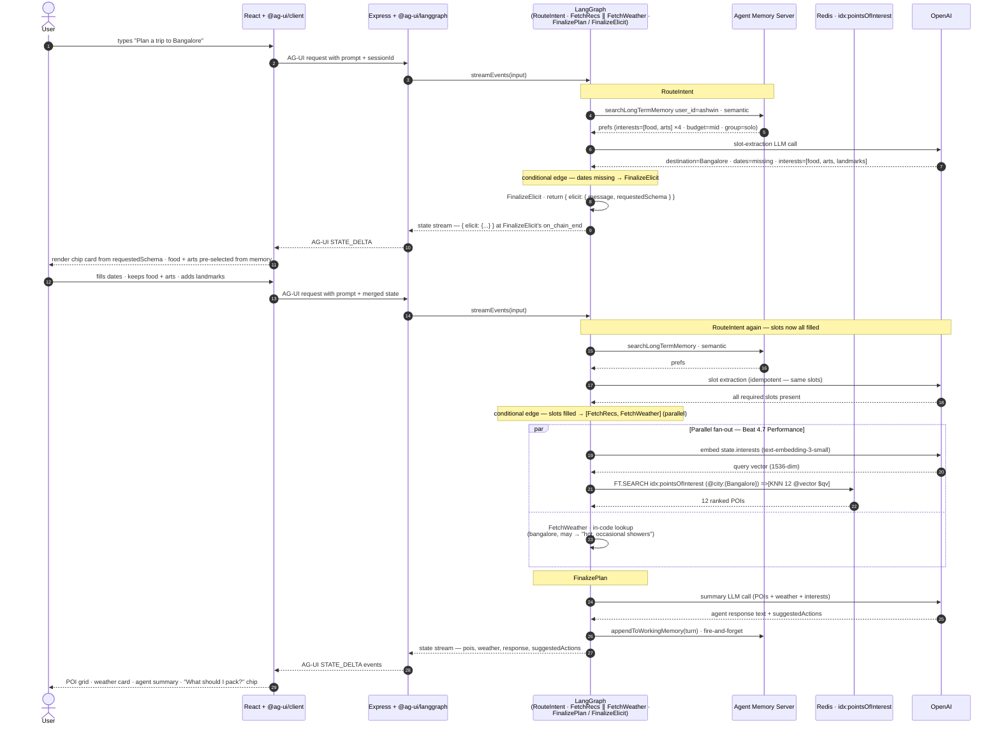
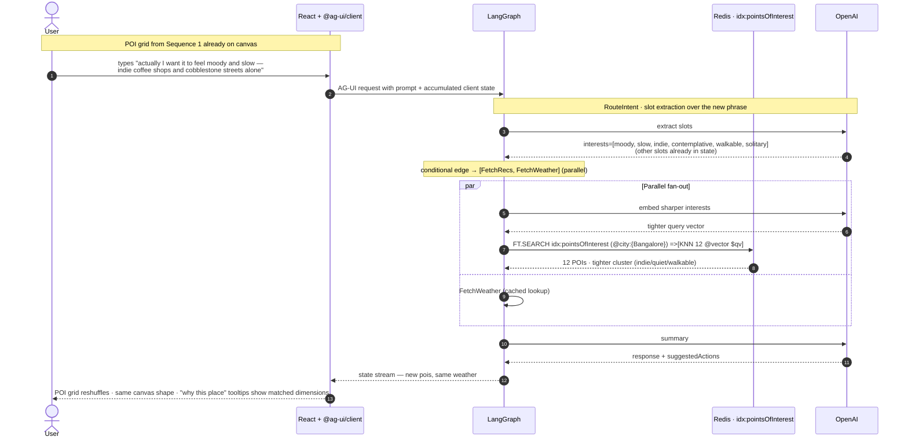
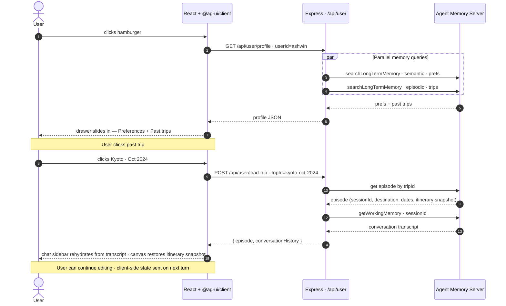

# 02 — User Flow Sequence Diagrams

Three sequences covering the demo's actual interaction paths.

Example question used throughout: **"Plan a trip to Bangalore."**

---

## Sequence 1 — Plan with elicit (two HTTP turns)

User types a planning query. `RouteIntent` extracts what it can but `dates` is missing. The graph routes to `FinalizeElicit` and returns the elicit spec as final state. The client renders a chip card; the user fills the dates; the client submits a new turn with the merged state. The graph runs end-to-end, fans out `FetchRecs ∥ FetchWeather`, and `FinalizePlan` returns the agent's summary plus `suggestedActions[]`.

---

## Sequence 2 — Refinement turn (sharper interests)

User articulates a sharper vibe on a follow-up turn. The same graph runs end-to-end; `FetchRecs` embeds the new interest descriptors and the hybrid `FT.SEARCH` returns a tighter KNN cluster around the new vector. No Google Places calls — the POI catalog is pre-seeded.

---

## Sequence 3 — Memory drawer + load past trip

Hamburger click opens the drawer. Clicking a past trip rehydrates from AMS only — the episodic record (for the trip metadata) plus working memory (for the conversation transcript). No LangGraph checkpoint involved.

---

## What these diagrams emphasize

- **Memory before extraction.** `RouteIntent` reads AMS preferences *before* extracting slots, so memory-sourced values prefill the elicit chip card. The "from memory" badge tracks which slots came from AMS vs. the prompt.
- **Stateless turns.** Each graph run is one-shot — no `interrupt()`, no checkpointer, no resume. Elicit is returned as final state; the client resubmits with merged state.
- **Parallel fetches = Beat 4.7 Performance.** Sequence 1 shows the parallel fan-out. The audience sees two AG-UI node-lifecycle events resolve concurrently in the sidebar.
- **Pre-seeded POI catalog.** The runtime never calls Google Places. Sequences 1 and 2 both touch only Redis + OpenAI embeddings on the request path.
- **AMS is the single source of truth for cross-session memory.** Sequence 3 shows it owns both the episodic record AND the conversation transcript. No RedisSaver to fall back on.
