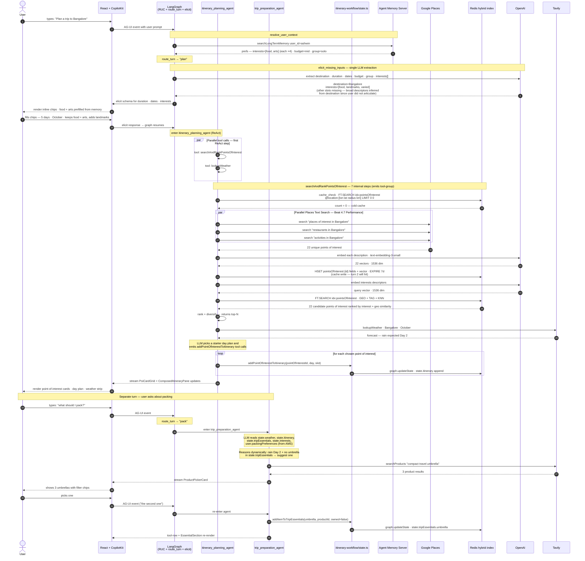
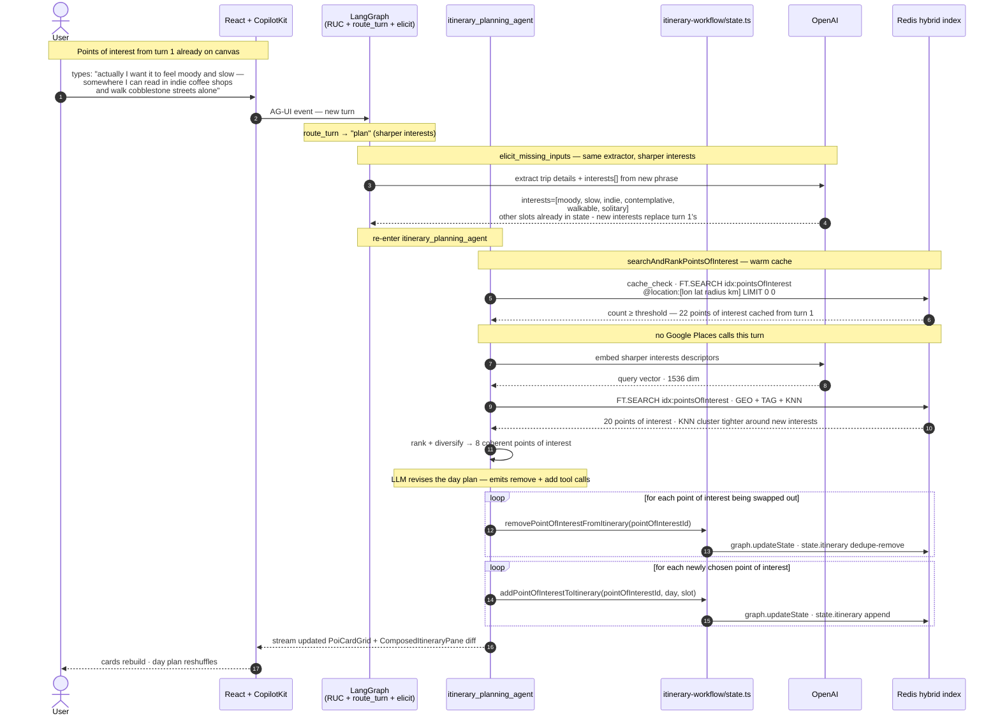
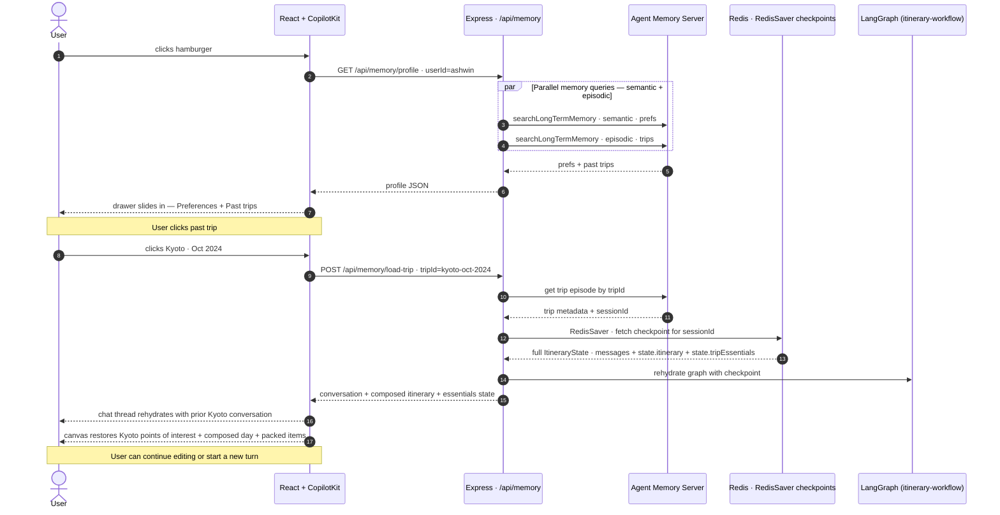
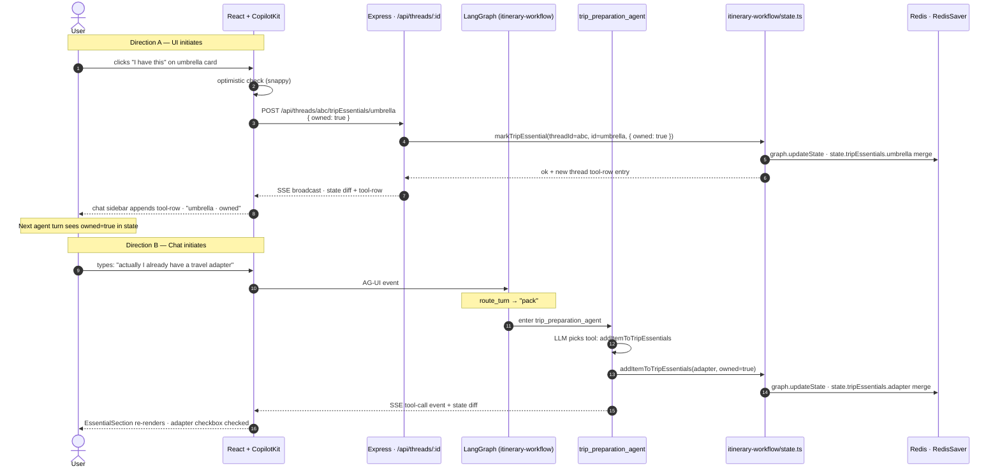

# 02 — User Flow Sequence Diagrams

Four sequences covering the demo's actual interaction paths.

Example question used throughout: **"Plan a trip to Bangalore."**

---

## Sequence 1 — Happy path: plan, then pack (two user turns)

User types a planning query. The router classifies it as `plan`, runs the elicit gate, then the `itinerary_planning_agent` calls its tools in a ReAct loop. Later, the user asks *"what should I pack?"* on a separate turn — the router classifies as `pack` and the `trip_preparation_agent` runs. Even a utilitarian prompt produces a non-empty `interests` array — the extractor reads broad descriptors from destination + duration when the user did not articulate explicitly.

---

## Sequence 2 — User refines on turn 2

After the first grid loads, the user articulates the interests they actually want. The router still classifies this as `plan` (or `edit` if the prompt explicitly names items), the same `itinerary_planning_agent` re-enters, and the LLM decides what tools to call. `searchAndRankPointsOfInterest` runs again with sharper `state.interests` — the cache write from turn 1 makes the second turn a warm-cache hit, so no Google Places calls fire.

---

## Sequence 3 — Memory drawer + load past trip

Hamburger click opens the drawer. Clicking a past trip rehydrates the graph's working memory from the stored checkpoint and replays the conversation + canvas state.

---

## Sequence 4 — Bidirectional sync (UI ↔ chat)

Either surface can mutate `state.tripEssentials` or `state.itinerary`. Both surfaces converge through the mutation helpers in `itinerary-workflow/state.ts` and re-render off the same CopilotKit state-delta channel. Shown here for essentials; points of interest follow the identical shape.

AMS is intentionally absent from this sequence: it ingests the conversation transcript on its own cadence and runs preference extraction asynchronously. Trip-scoped state (`itinerary`, `tripEssentials`) lives only in the RedisSaver checkpoint.

---

## What these diagrams emphasize

- **Memory before routing.** `resolve_user_context` runs *first* on every turn — so when chips are elicited, the user's recurring interests (`food`, `arts`) are already prefilled on the multi-select chip card. That's the source of the "from memory" indicator. The router then sees a fully-grounded state when classifying intent.
- **Parallel tool calls = Beat 4.7 Performance.** The planning agent issues `searchAndRankPointsOfInterest` + `lookupWeather` in parallel on the first ReAct step (Sequence 1). Inside `searchAndRankPointsOfInterest` itself, three Places Text Search queries fan out in parallel. The audience sees nested tool-group rows resolve concurrently in the chat sidebar.
- **Warm cache on turn 2.** Sequence 2 demonstrates the HSET cache-write from turn 1 paying off — no Google Places calls fire on the refinement turn, the agent goes straight from cache_check to FT.SEARCH KNN. This is non-negotiable in `searchAndRankPointsOfInterest` — without it every turn is a cold miss.
- **One query shape, every turn.** Sequence 2 walks the same `searchAndRankPointsOfInterest` tool as Sequence 1 — what differs is `state.interests`, which sharpens the query vector. Same hybrid `FT.SEARCH` (GEO + TAG + KNN), same client component, different cluster.
- **`RedisSaver` is what powers "load past trip."** Sequence 3 shows that flow explicitly — the checkpoint store lives in the same Redis instance as the points-of-interest cache and the Agent Memory Server's working memory. Now also restores `state.tripEssentials`, not just `state.itinerary`.
- **Two write paths, one store.** Sequence 4 makes the bidirectional sync concrete: both the agent's tool call and the REST handler converge on the mutation helpers in `itinerary-workflow/state.ts`, so the chat and canvas never drift. Tool-row entries appear in the chat thread regardless of which side initiated.
- **Elicitation is a real spec primitive, not custom UI.** Phase 1 chip-filling uses the literal MCP `elicit` mechanism. The packing flow does not use elicit — the trip-preparation agent drives that interaction conversationally via tool calls.
