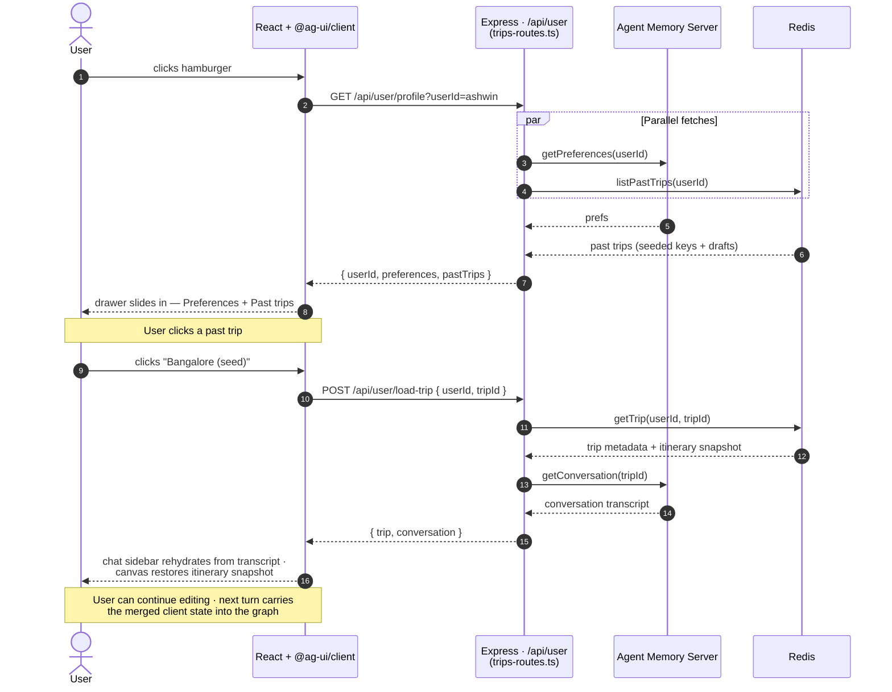

# 02 — User Flow Sequence Diagrams

Three sequences covering the demo's actual interaction paths.

Example question used throughout: **"Plan a trip to Bangalore."**

---

## Sequence 1 — Plan with elicit (two HTTP turns)

User types a planning query. `ContextRetriever` loads preferences + transcript + trip draft. `TravelAgent`'s LLM tries to plan but recognizes critical slots are missing (e.g. dates), so it returns a brief response. `FollowUp` extracts the current-turn slots, computes `needsMoreInfo=true`, and returns `state.elicit = { mode, message, requestedSchema }` as final state. The client renders a chip card; the user fills the dates; the client submits a new turn with the merged state. Second run goes end-to-end — `TravelAgent` emits `searchPois` + `getWeather` in parallel; `FollowUp` returns `pois`, `weather`, `response`, and `suggestedActions[]`.

```mermaid
sequenceDiagram
    autonumber
    actor User
    participant UI as React + @ag-ui/client
    participant Run as chat.ts (AG-UI / SSE)
    participant Runtime as runtime.ts<br/>(streamPlannerTurn)
    participant Graph as Graph<br/>(CR → TA → FU)
    participant AMS as Agent Memory Server
    participant Redis as Redis · trip-store +<br/>idx:pointsOfInterest
    participant LLM as OpenAI

    User->>UI: types "Plan a trip to Bangalore"
    UI->>Run: POST /api/chat (AG-UI request body)
    Run->>Runtime: streamPlannerTurn({ userId, tripId, userMessage, state })
    Runtime->>Graph: graph.stream(input, { streamMode: 'updates' })

    Note over Graph,AMS: ContextRetriever
    Graph->>AMS: getPreferences(userId) · getConversation(tripId)
    AMS-->>Graph: prefs (recurringInterests=[food, arts], …) + transcript
    Graph->>Redis: getTrip(userId, tripId)
    Redis-->>Graph: existing trip draft

    Note over Graph,LLM: TravelAgent (ReAct loop)
    Graph->>LLM: ReAct step with bound tools
    LLM-->>Graph: brief response + signals missing dates<br/>(no tool calls emitted yet)

    Note over Graph,LLM: FollowUp
    Graph->>LLM: extraction LLM call (structured output)
    LLM-->>Graph: { slots: { destination=Bangalore }, needsMoreInfo=true, response, followups }
    Graph->>Graph: buildElicit({ missingFields=[dates], preferences }) → ElicitSpec
    Graph->>Redis: ensureDraft(userId, tripId, …)
    Graph->>AMS: appendTurn(tripId, turn) · fire-and-forget

    Runtime-->>Run: onNodeUpdate(FollowUp, { elicit, response, … }) → onFinish
    Run-->>UI: SSE: STATE_SNAPSHOT { elicit: {...}, response, … }<br/>then RUN_FINISHED
    UI-->>User: render chip card from requestedSchema<br/>(food + arts pre-selected from memory)

    User->>UI: fills dates · keeps food + arts · adds landmarks
    UI->>Run: POST /api/chat with merged client state
    Run->>Runtime: streamPlannerTurn(...)
    Runtime->>Graph: graph.stream(...)

    Note over Graph,AMS: ContextRetriever (re-hydrate)
    Graph->>AMS: getPreferences · getConversation
    AMS-->>Graph: prefs + transcript (now includes prior elicit turn)
    Graph->>Redis: getTrip
    Redis-->>Graph: trip draft

    Note over Graph,LLM: TravelAgent — slots filled, plan trip
    Graph->>LLM: ReAct step; LLM emits searchPois + getWeather in one turn

    par Parallel tool calls inside TravelAgent
        Graph->>LLM: embed state.interests (text-embedding-3-small)
        LLM-->>Graph: query vector (1536-dim)
        Graph->>Redis: searchPois · FT.SEARCH idx:pointsOfInterest<br/>(@city:{Bangalore}) =>[KNN 12 @vector $qv]
        Redis-->>Graph: 12 ranked POIs
    and
        Graph->>Graph: getWeather · in-code city/month lookup
    end

    Graph->>LLM: ReAct loop continues; LLM composes final response
    LLM-->>Graph: response text

    Note over Graph,LLM: FollowUp
    Graph->>LLM: extraction LLM call (structured output)
    LLM-->>Graph: { slots all present, needsMoreInfo=false, response, followups }
    Graph->>Redis: ensureDraft(…)
    Graph->>AMS: appendTurn(…) · fire-and-forget

    Runtime-->>Run: onNodeUpdate(deltas) → onFinish
    Run-->>UI: SSE: STATE_SNAPSHOT { pois, weather, response, suggestedActions } + RUN_FINISHED
    UI-->>User: POI grid · weather card · agent summary ·<br/>"What should I pack?" chip
```

---

## Sequence 2 — Refinement turn (sharper interests)

User articulates a sharper vibe on a follow-up turn. The same graph runs end-to-end; `TravelAgent`'s ReAct loop re-issues `searchPois` with the new interest descriptors, the hybrid `FT.SEARCH` returns a tighter KNN cluster around the new vector. No Google Places calls — the POI catalog is pre-seeded.

```mermaid
sequenceDiagram
    autonumber
    actor User
    participant UI as React + @ag-ui/client
    participant Run as chat.ts (AG-UI / SSE)
    participant Runtime as runtime.ts
    participant Graph as Graph (CR → TA → FU)
    participant Redis
    participant LLM as OpenAI

    Note over User,UI: POI grid from Sequence 1 already on canvas
    User->>UI: types "actually I want it to feel moody and slow —<br/>indie coffee shops and cobblestone streets alone"
    UI->>Run: POST /api/chat with accumulated client state
    Run->>Runtime: streamPlannerTurn(...)
    Runtime->>Graph: graph.stream(...)

    Note over Graph: ContextRetriever (re-hydrate; preferences cached but transcript grows)

    Note over Graph,LLM: TravelAgent — LLM picks up new interest descriptors
    Graph->>LLM: ReAct step
    LLM-->>Graph: emits searchPois (only — weather already in state)

    par Parallel tool calls (single tool here, but bound for parallelism)
        Graph->>LLM: embed sharper interests
        LLM-->>Graph: tighter query vector
        Graph->>Redis: searchPois · FT.SEARCH (@city:{Bangalore}) =>[KNN 12 @vector $qv]
        Redis-->>Graph: 12 POIs · tighter cluster (indie/quiet/walkable)
    end

    Graph->>LLM: ReAct loop continues; LLM composes response
    LLM-->>Graph: response

    Note over Graph: FollowUp emits suggestedActions
    Runtime-->>Run: deltas
    Run-->>UI: SSE: STATE_SNAPSHOT { pois (new), response, suggestedActions }
    UI-->>User: POI grid reshuffles · same canvas shape ·<br/>"why this place" tooltips show matched dimensions
```

---

## Sequence 3 — Memory drawer + load past trip

Hamburger click opens the memory drawer. Loading a past trip rehydrates from AMS (preferences + working memory) and Redis (the seeded past-trip metadata). No LangGraph run involved — these are plain REST endpoints on `/api/user`.



---

## What these diagrams emphasize

- **Memory before extraction.** `ContextRetriever` reads AMS preferences + transcript *before* `TravelAgent` runs, so memory-sourced values prefill the elicit chip card that `FollowUp` builds. The "from memory" badge tracks which slots came from AMS vs. the prompt.
- **Stateless turns.** Each graph run is one-shot — no `interrupt()`, no checkpointer. Elicit is returned as final state; the client resubmits with merged state.
- **Parallelism lives inside `TravelAgent`.** The LLM is system-prompted to emit `searchPois` + `getWeather` together for trip-planning intents. The agent runtime runs the tool calls concurrently. Visible in the AG-UI event stream as overlapping `STATE_SNAPSHOT` deltas (`pois` and `weather` arriving close together).
- **Pre-seeded POI catalog.** The runtime never calls Google Places. Sequences 1 and 2 both touch only Redis + OpenAI (embeddings + chat) on the request path.
- **Memory drawer doesn't touch the graph.** Sequence 3 is plain REST against `/api/user`, served by `trips-routes.ts`. The trip-store HASH lives in Redis; the transcript lives in AMS. Both are read directly.
