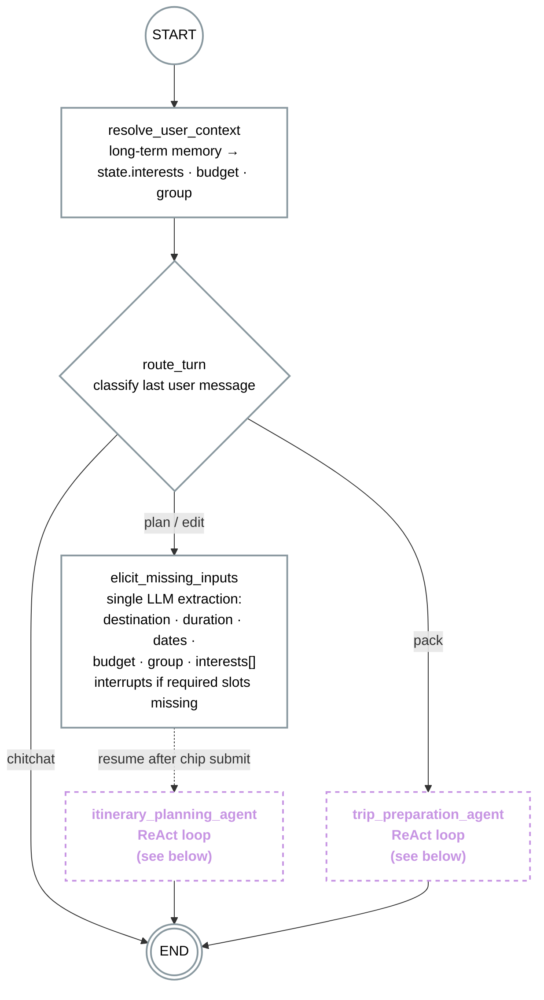
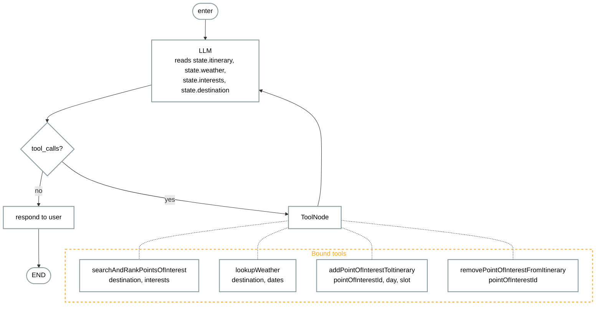
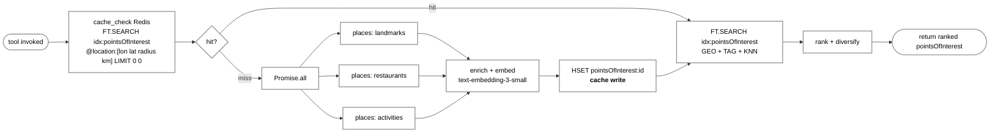
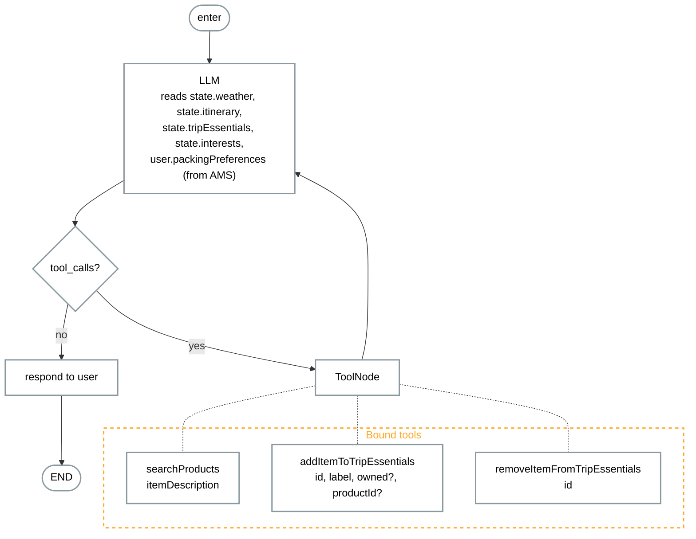
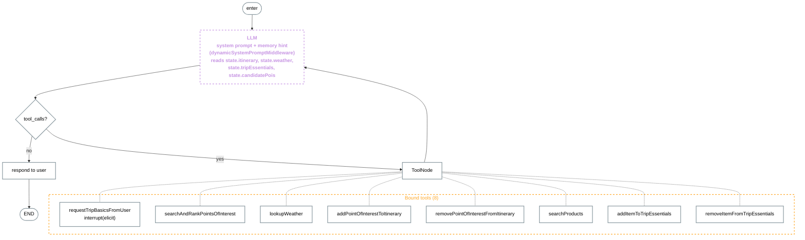

# 03 — LangGraph Workflows

The LangGraph topology that orchestrates the demo.

Two sections — **v1** describes the original multi-node topology (one router + two ReAct agents + dedicated context + elicit nodes). **v2** describes the current topology after the migration: one `itinerary_agent` (`createAgent` from `langchain`) with eight bound tools, no router, no separate context/elicit nodes. The hosting topology change (single-process → two-process with `langgraphjs dev`) is documented in `01-system-architecture.md`.

---

## v1 — Multi-node: router + two ReAct agents

One graph, one router, two ReAct agents — `itinerary_planning_agent` owns the trip plan, `trip_preparation_agent` owns trip essentials. Each agent's tools are the only path to mutate the slice of state it owns; the same write functions are also exposed via REST so UI affordances stay in sync.

### Top-level graph

`resolve_user_context` projects long-term memory onto state, `route_turn` classifies the user's intent for this turn, and one of two agents runs to completion before the turn ends. Required-slot extraction only runs ahead of the planning agent and only interrupts when chips need to be elicited.

#### Notes on the top-level graph

- **One graph, two agents.** The previous design split planning and trip-prep into two separate graphs with a handoff. That collapsed once it became clear they share state (`destination`, `weather`, `itinerary`) and the user can drive either at any time — packing might be asked before the plan is final, the plan can be edited after packing started. A single graph with a router lets the user move between modes without state shuffling.
- **`resolve_user_context` always runs first.** Memory-sourced preferences (interests, budget, group) land on state before routing, so both agents see the same grounded context. This is what powers the *"from memory"* banner.
- **`route_turn` is a conditional edge, not a node.** It inspects `state.messages[-1]` (and optionally calls a cheap classifier LLM for ambiguous turns) and returns one of `plan` / `edit` / `pack` / `chitchat`. `plan` and `edit` both head into the planning agent; only `plan` passes through `elicit_missing_inputs` first.
- **Agents are atomic to the parent graph.** Their internal tool loops are checkpointed inside themselves; the parent graph just sees "agent ran, state updated, turn done".

---

### itinerary_planning_agent (ReAct)

Built with `createReactAgent`. Reads `state.itinerary`, `state.weather`, `state.interests`; mutates them through bound tools. On first turn the system prompt instructs parallel calls of `searchAndRankPointsOfInterest` + `lookupWeather`, then a series of `addPointOfInterestToItinerary` to compose the day plan. On edit turns it picks `addPointOfInterestToItinerary` / `removePointOfInterestFromItinerary` based on what the user asked for.

#### searchAndRankPointsOfInterest — internal flow

This tool encapsulates everything the old `searchDestinationPois` node + `rankPois` node did. It emits seven sub-progress events the client renders as a nested `tool-group`, but to the agent's LLM it's one tool call returning ranked candidates. The HSET cache-write step is non-skippable — it's what makes turn 2 a warm-cache hit.

---

### trip_preparation_agent (ReAct)

Built with `createReactAgent`. Reads `state.weather`, `state.itinerary`, `state.tripEssentials`, `state.interests`, and the user's long-term packing preferences (loaded by `resolve_user_context` from AMS). The agent *reasons* about what essentials make sense for this specific trip — there is no hardcoded catalog. It considers weather (rain → umbrella), itinerary (hiking points of interest → boots), interests (photography → spare batteries), and the user's history (this user always packs a power bank). Mutates `state.tripEssentials` through bound tools. Calls `searchProducts` only when it wants to surface concrete buyable suggestions for items the user doesn't already own.

#### Notes on the agents

- **No `lookupWeather` tool here.** The planning agent already populated `state.weather` on the first planning turn; the prep agent reads it from state. Avoiding a duplicate tool keeps the agent's tool surface minimal.
- **No static essentials catalog.** The agent generates suggestions dynamically by reasoning over `state.weather`, `state.itinerary`, `state.interests`, and the user's long-term packing preferences. There is no list of "things people typically pack for Bangalore in March" injected into the prompt — that constraint would make the suggestions generic and indistinguishable across users.
- **Storage split.** Trip-scoped data (`state.itinerary`, `state.tripEssentials`) lives in Redis JSON inside the session checkpoint, written via the mutation helpers in `itinerary-workflow/state.ts`. AMS is only for conversation transcripts and the cross-session preferences/memories extracted from them (e.g., "user always packs a power bank"). The mutation tools never write to AMS directly — AMS ingests the conversation separately and runs its own extraction.
- **Symmetry with the planning agent.** Both agents own one state slice (`itinerary` / `tripEssentials`), expose mutation tools as the only write path, and read everything else from state. Same shape, different domain.

---

### Bidirectional sync — UI ↔ chat

Every tool a graph agent calls is a thin wrapper around a function in `server/src/modules/ai/itinerary-workflow/state.ts` (`pinPointOfInterest`, `unpinPointOfInterest`, `markTripEssential`, `unmarkTripEssential`). The same module is also imported by the REST routes in `itinerary/api/itinerary-routes.ts` that handle UI affordances — checkbox clicks, point-of-interest card "Add"/"Remove" buttons:

- `POST   /api/itinerary/:threadId/entries` — pin a point-of-interest
- `DELETE /api/itinerary/:threadId/days/:dayId/entries/:entryId` — unpin
- `PUT    /api/itinerary/:threadId/tripEssentials/:essentialId` — mark / upsert
- `DELETE /api/itinerary/:threadId/tripEssentials/:essentialId` — unmark

- **UI → chat**: the REST handler calls `graph.updateState(threadId, …)` plus appends a tool-row entry to the thread, then broadcasts via SSE. The agent reads the updated state on its next invocation.
- **Chat → UI**: the agent's tool call goes through the same write function, the LangGraph stream emits a tool-call event the client receives via SSE, and the UI re-renders the affected card.

Detailed sequence is in `02-user-flow-sequence.md` (Sequence 4).

---

### Where graph elements hook into the UI

| Element | Triggers UI render | Owns the event |
|---|---|---|
| `elicit_missing_inputs` node | `InlineVariableChips` in `prompt/` | `elicit_request` event |
| `searchAndRankPointsOfInterest` tool (inside planning agent) | `PointOfInterestCardGrid` in `point-of-interest/`, `RouteMap`; nested tool-rows for the 7-step group | `tool_call` events + `ui_update` payload |
| `addPointOfInterestToItinerary` / `removePointOfInterestFromItinerary` tools | `ComposedItineraryPane` re-render; tool-row in chat | state diff + tool-row event |
| `searchProducts` tool | `ProductPickerCard` in `trip-prep/` | `tool_call` event with product payload |
| `addItemToTripEssentials` / `removeItemFromTripEssentials` tools | `EssentialSection` checkbox state; tool-row in chat | state diff + tool-row event |

A frontend dev in the audience can trace (a) the agent tool, (b) the SSE event it emits, (c) the React component that renders it.

### Why two ReAct agents (not one big graph)

An earlier design split planning and trip-prep into two separate graphs with a `handoff` arrow. That collapsed once it was clear the two domains share state and the user can move between them at any time. A single graph with `route_turn` lets the user say *"what should I pack?"* mid-plan and *"actually remove the Louvre"* mid-pack — no state shuffling, no graph switch.

Within the planning side, an earlier design also had a deterministic `plan_trip` node followed by a `plan_agent` for edits. That collapsed too: both first-turn generation and edits end in an LLM call that decides which tools to invoke, so making it ReAct from the start removes a duplicate node and keeps the agent's contract symmetric with `trip_preparation_agent`. The trade-off — ~300-500ms of first-turn LLM latency before search starts — buys one mental model instead of two and matches the prototype's "single canvas, single turn machine" UX.

---

## v2 — Single agent: one `itinerary_agent`, eight tools

The v1 multi-node topology — `resolve_user_context` → `route_turn` → `{elicit_missing_inputs → itinerary_planning_agent, trip_preparation_agent}` — collapsed into a single `createAgent` (from `langchain`) ReAct loop named `itinerary_agent`. It owns both planning and trip-prep, and all eight tools live on it.

What used to be dedicated graph nodes is now expressed differently:

- **Memory hint** — `dynamicSystemPromptMiddleware` queries `getUserPreferences(userId)` on every invocation and appends a one-line advisory hint (`interests=…, budget=…, groupSize=…`) to the system prompt. There is no `resolve_user_context` node.
- **Elicitation** — `requestTripBasicsFromUser` is a tool. It calls `interrupt(elicit)` to pause the graph when the agent decides destination cannot be inferred from the conversation. There is no `elicit_missing_inputs` node and no always-on extraction.
- **Routing** — gone. The agent's LLM picks tools per turn; planning vs trip-prep is a tool-selection decision, not a graph branch.

### Single-agent graph

### Tool-selection rules baked into the system prompt

The prompt in `agents.ts` is the only routing logic in v2 — it tells the LLM:

1. If the user states a destination, go straight to `searchAndRankPointsOfInterest` + `lookupWeather`.
2. Then fan out `addPointOfInterestToItinerary` calls to fill the itinerary days.
3. Optionally surface a few trip essentials (`searchProducts` only if attaching a buyable suggestion).
4. Only invoke `requestTripBasicsFromUser` when destination is genuinely missing.

After tools run, the agent replies with a short one-paragraph summary. The UI re-renders from state, so the message body never re-lists itinerary entries or essentials.

### `searchAndRankPointsOfInterest` — internal flow (unchanged)

The internal seven-step flow of this tool is the same as v1 — cache check → parallel Places fan-out → enrich + embed → HSET cache-write → hybrid `FT.SEARCH` (GEO + TAG + KNN) → rank + diversify. See the v1 diagram above; the tool itself didn't change in v2, only the agent that calls it.

### Why one agent (in v2)

The v1 split between planning and trip-prep was clean on paper but produced consistent friction in practice: every turn paid the `route_turn` classification cost, and `state.interests` / `state.weather` / `state.itinerary` were all shared between the two agents anyway. With `createAgent`'s ReAct loop the LLM picks `searchAndRankPointsOfInterest` for planning, `searchProducts` for prep, and `requestTripBasicsFromUser` for elicit — same store, same checkpointer, no router, no handoff.

The v1 file comment in `agents.ts` summarises it: *"Eight tools, one createAgent loop, no extra graph wrapper — the agent IS the compiled workflow."*

### What's different vs v1 (delta)

- Single `itinerary_agent` instead of `itinerary_planning_agent` + `trip_preparation_agent`.
- No `route_turn` conditional edge — tool selection replaces it.
- No `resolve_user_context` node — memory hint is a middleware on the system prompt.
- No `elicit_missing_inputs` node — `requestTripBasicsFromUser` tool handles it via `interrupt()`, called only when needed.
- Built with `createAgent` from the `langchain` package, not `createReactAgent` from `@langchain/langgraph/prebuilt`.

### What stayed the same

- The eight tool implementations.
- The `searchAndRankPointsOfInterest` internal seven-step flow.
- The mutation-helper convergence pattern in `itinerary-workflow/state.ts`.
- The Redis hybrid index, the Agent Memory Server, and every external service.
