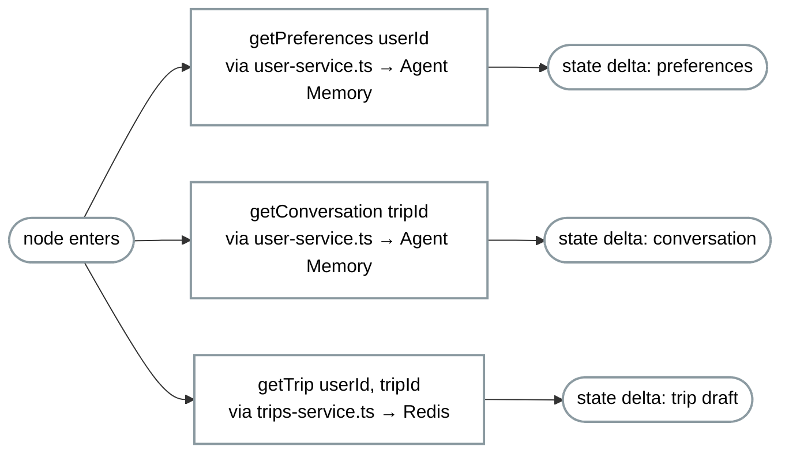
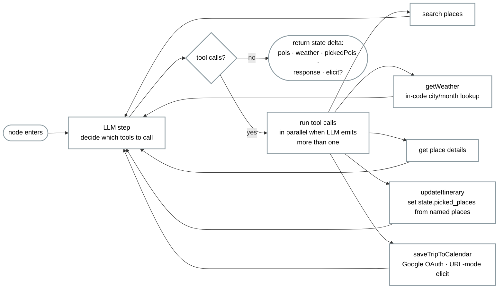
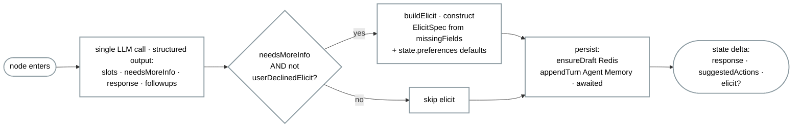

# 03 — LangGraph Workflows

The LangGraph topology that orchestrates the demo.

One graph, three linear nodes, no checkpointer. The decision-making LLM lives inside `TravelAgent` as a ReAct loop with bound tools. State streams as per-node deltas via `graph.stream(input, { streamMode: 'updates' })` (wrapped by `streamPlannerTurn` in `runtime.ts`); adapters translate each delta into their transport-native events.

---

## The graph

```mermaid
flowchart TD
    Start((START)) --> CR[ContextRetriever<br/>load Redis trip-store + Agent Memory (Iris)<br/>preferences and session transcript]
    CR --> TA[TravelAgent<br/>ReAct loop with bound tools]
    TA --> FU[FollowUp<br/>extract slots · decide elicit ·<br/>suggestedActions · persist]
    FU --> End(((END)))

    classDef nodeStyle fill:transparent,color:#000000,stroke:#8a99a0,stroke-width:2px
    classDef purple fill:transparent,color:#c795e3,stroke:#c795e3,stroke-width:2px,font-weight:bold,stroke-dasharray: 5 5
    class Start,End,CR,TA,FU nodeStyle
    class CR,TA,FU purple
```

#### Notes on the topology

- **Linear, no branching at the graph level.** No conditional edges, no router. The branching that matters (whether to elicit, which tool to call) happens *inside* nodes — `TravelAgent`'s ReAct loop and `FollowUp`'s single LLM call.
- **No checkpointer.** Each graph run is one-shot. State that survives between turns lives on the client (filled slots, picked POIs) and in Agent Memory (Iris) (conversation, preferences, past trips).
- **Elicit returned as state.** `FollowUp` returns `state.elicit = { mode, message, requestedSchema }` as the graph's final output when required slots are missing and the user hasn't already declined. The graph ends; the adapter handles the round-trip.
- **Streaming.** `runtime.ts` calls `graph.stream(input, { streamMode: 'updates' })` and fans the per-node delta dictionary out as `onNodeStart`/`onNodeUpdate`/`onNodeFinish` callbacks to the adapter.

---

## ContextRetriever — internal flow

Single read point at graph entry. Hydrates state from Redis (the current trip draft) and Agent Memory (Iris) (recurring preferences + the live conversation transcript). One round each, no parallelism needed — these are the prerequisites every downstream node assumes.



---

## TravelAgent — internal flow (ReAct loop with bound tools)

The LLM decides which tools to call. The system prompt tells it to emit multiple tool calls in one turn when planning a trip — typically `searchPois` + `getWeather` in parallel. Tool results are fed back into the loop until the LLM has no more tool calls to emit.



Notes:

- **`searchPois`** runs hybrid retrieval: city TAG filter + KNN over an embedding of the user's interest descriptors. The `location` field on the POI hashes is GEO-indexed but never queried with a GEO filter at runtime.
- **`getWeather`** is a local lookup in `weather-repository.ts` — no API call.
- **`saveTripToCalendar`** is the one tool that triggers an elicit *from inside `TravelAgent`*: when no cached Google token exists, the tool returns `needsAuth: true` and emits a URL-mode `state.elicit` carrying the OAuth start URL. The adapter (MCP) handles the OAuth round-trip; on the next graph invocation the tool sees the cached token and proceeds.

---

## FollowUp — internal flow

One structured-output LLM call drives everything. Extracts current-turn slots from the full conversation history, decides whether to elicit, generates `suggestedActions[]`, and persists.



`userDeclinedElicit` is a one-shot flag the MCP adapter sets on `decline` so the graph doesn't re-elicit the same slots on the immediate next turn.

---

## Where graph elements hook into the UI

`streamPlannerTurn` emits per-node deltas via callbacks; `chat.ts` translates each into an `@ag-ui/core` event.

| Element | Triggers UI render | AG-UI event |
|---|---|---|
| Graph run starts | sidebar tool-row scaffold | `RUN_STARTED` |
| `ContextRetriever` enters | sidebar tool-row entry | `STEP_STARTED` |
| `ContextRetriever` delta | canvas patches `state.preferences` / `state.conversation` | `STATE_SNAPSHOT` |
| `ContextRetriever` exits | tool-row entry resolves | `STEP_FINISHED` |
| `TravelAgent` enters/deltas | per-tool sidebar dots, POI grid renders on `state.pois`, weather card on `state.weather` | `STEP_STARTED` / `STATE_SNAPSHOT` per delta |
| `TravelAgent` exits | tool-row resolves | `STEP_FINISHED` |
| `FollowUp` delta — `suggestedActions` | follow-up chips render | `STATE_SNAPSHOT` |
| `FollowUp` delta — `elicit` | chip card renders from `requestedSchema` | `STATE_SNAPSHOT` |
| Graph run ends | sidebar tool-row resolves | `RUN_FINISHED` |

---

## Why three nodes and not one ReAct agent

The graph could have been a single `createReactAgent` call — `TravelAgent` already covers the LLM-driven tool dispatch. The reason for the wrap is that **two boundary concerns don't belong inside the ReAct loop**:

- **Read concerns** (`ContextRetriever`) — every turn needs the same hydration of preferences + transcript + trip draft *before* the LLM sees the user message. Doing it inside the agent's system prompt would mean re-running the loads on every tool-call iteration. The pre-step is cleaner.
- **Write + elicit concerns** (`FollowUp`) — extracting slots, computing `needsMoreInfo`, building the elicit schema, and writing to Agent Memory + Redis all happen *after* the agent has decided what to do. Mixing this with tool dispatch confuses the LLM (it starts trying to "extract" things mid-turn). One node, one structured-output call, one persist.

Both boundary nodes are deterministic-ish and short. `TravelAgent` is where the interesting LLM autonomy lives.
