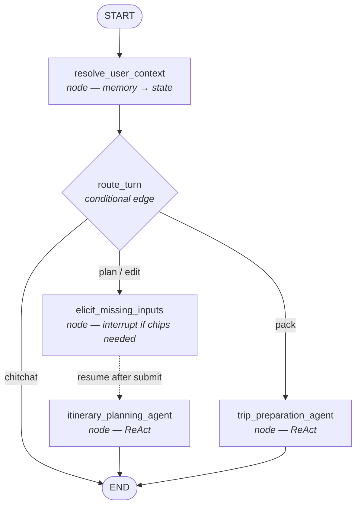
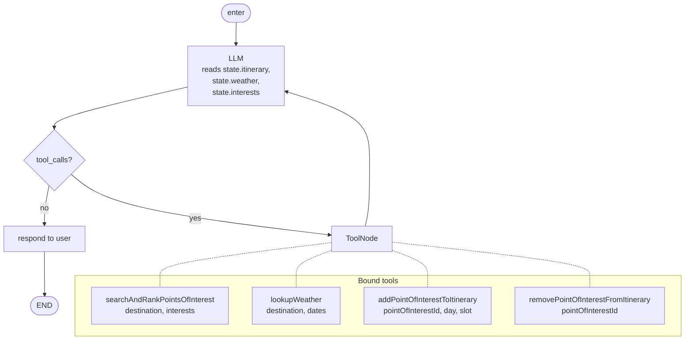
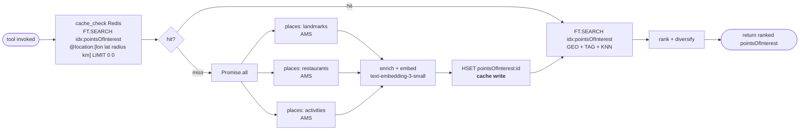
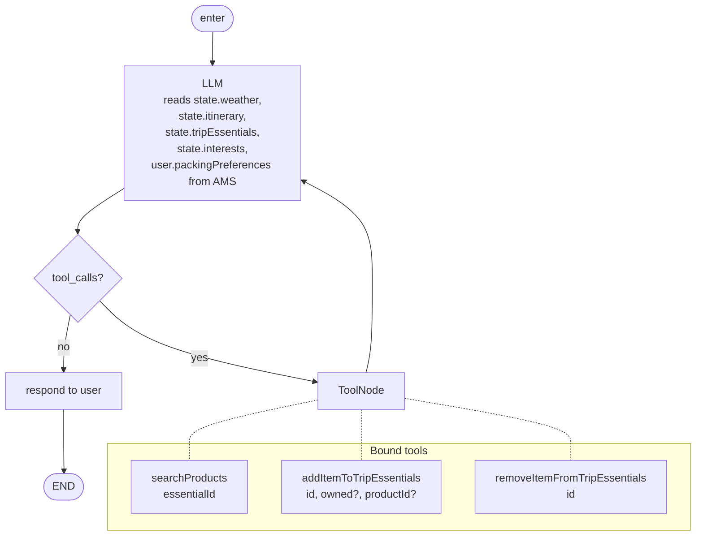

## Top level

```mermaid
flowchart TD
      START([START]) --> RUC[resolve_user_context<br/><i>node — memory → state</i>]
      RUC --> ROUTE{route_turn<br/><i>conditional edge</i>}

      ROUTE -- plan / edit --> ELI[elicit_missing_inputs<br/><i>node — interrupt if chips needed</i>]
      ROUTE -- pack --> PKA[trip_preparation_agent<br/><i>node — ReAct</i>]
      ROUTE -- chitchat --> END([END])

      ELI -. resume after submit .-> PA[itinerary_planning_agent<br/><i>node — ReAct</i>]
      PA --> END
      PKA --> END
```

## itinerary_planning_agent

```mermaid

flowchart TD
      IN([enter]) --> LLM[LLM<br/>reads state.itinerary,<br/>state.weather,<br/>state.interests]
      LLM --> D{tool_calls?}
      D -- no --> RESP[respond to user]
      D -- yes --> TN[ToolNode]
      TN --> LLM
      RESP --> OUT([END])
      subgraph Bound tools
          T1[searchAndRankPointsOfInterest<br/>destination, interests]
          T2[lookupWeather<br/>destination, dates]
          T3[addPointOfInterestToItinerary<br/>pointOfInterestId, day, slot]
          T4[removePointOfInterestFromItinerary<br/>pointOfInterestId]
      end
      TN -.- T1 & T2 & T3 & T4
```

### searchAndRankPointsOfInterest

```mermaid
flowchart LR
      IN([tool invoked]) --> CC["cache_check Redis<br/>FT.SEARCH idx:pointsOfInterest<br/>@location:[lon lat radius km] LIMIT 0 0"]
      CC --> M{hit?}
      M -- hit --> K
      M -- miss --> P[Promise.all]
      P --> P1[places: landmarks<br/>AMS]
      P --> P2[places: restaurants<br/>AMS]
      P --> P3[places: activities<br/>AMS]
      P1 & P2 & P3 --> E[enrich + embed<br/>text-embedding-3-small]
      E --> W[HSET pointsOfInterest:id<br/><b>cache write</b>]
      W --> K[FT.SEARCH idx:pointsOfInterest<br/>GEO + TAG + KNN]
      K --> R[rank + diversify]
      R --> OUT([return ranked pointsOfInterest])
```

## trip_preparation_agent

```mermaid
  flowchart TD
      IN([enter]) --> LLM[LLM<br/>reads state.weather,<br/>state.itinerary,<br/>state.tripEssentials,<br/>state.interests,<br/>user.packingPreferences from AMS]
      LLM --> D{tool_calls?}
      D -- no --> RESP[respond to user]
      D -- yes --> TN[ToolNode]
      TN --> LLM
      RESP --> OUT([END])
      subgraph Bound tools
          T1[searchProducts<br/>essentialId]
          T2[addItemToTripEssentials<br/>id, owned?, productId?]
          T3[removeItemFromTripEssentials<br/>id]
      end
      TN -.- T1 & T2 & T3
```