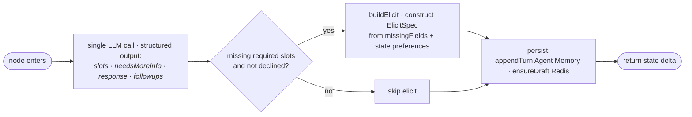

# Canonical graph sketch

Source-of-truth Mermaid for the current graph topology. The richer diagrams (01, 02, 03, with-mcp) elaborate on this.

## Top level

```mermaid
flowchart TD
      START([START]) --> CR[ContextRetriever<br/><i>hydrate from Redis trip-store + Agent Memory (Iris)</i>]
      CR --> TA[TravelAgent<br/><i>ReAct loop with bound tools</i>]
      TA --> FU[FollowUp<br/><i>extract slots · decide elicit · suggestedActions ·<br/>persist appendTurn + ensureDraft</i>]
      FU --> END([END])
```

Three nodes, linear. No branching at the graph level. No checkpointer, no `interrupt()`. Each graph run is one-shot; when slots are missing, `FollowUp` returns `state.elicit = { mode, message, requestedSchema }` as final state. The adapter (AG-UI or MCP) handles the round-trip; on the next invocation the graph runs again with the merged state.

## TravelAgent internal

The decision-making LLM lives inside `TravelAgent`. It's a ReAct loop with five bound tools; the system prompt instructs it to emit multiple tool calls in a single turn when a planning intent implies more than one (e.g. `searchPois` + `getWeather` in parallel).

```mermaid
flowchart LR
      LLM[LLM step<br/><i>decide which tools to call</i>]
      LLM --> ToolFanout{tool call(s)}
      ToolFanout --> SP[searchPois<br/><i>FT.SEARCH<br/>(@city:&#123;X&#125;) =&gt;[KNN k @vector $qv]</i>]
      ToolFanout --> GW[getWeather<br/><i>in-code city/month lookup</i>]
      ToolFanout --> GPD[getPoiDetails<br/><i>HGETALL on POI hash</i>]
      ToolFanout --> UI[updateItinerary<br/><i>set state.pickedPois</i>]
      ToolFanout --> STC[saveTripToCalendar<br/><i>Google OAuth · URL-mode elicit</i>]
      SP --> LLM
      GW --> LLM
      GPD --> LLM
      UI --> LLM
      STC --> LLM
      LLM -. all tool calls resolved .-> Done([return to graph])
```

The POI catalog is pre-seeded by `scripts/seed-pois.js` (Google Places at seed time only). At runtime, `searchPois` only hits Redis. `getWeather` is an in-code lookup — no API call.

## FollowUp internal



`FollowUp` extracts current-turn slots from the full conversation, decides whether to elicit, generates `suggestedActions[]`, then persists any new slot values to the Redis trip-store and appends the turn to the Agent Memory (Iris) session. The transcript write is awaited, so the next turn's `ContextRetriever` hydrates a complete conversation.
