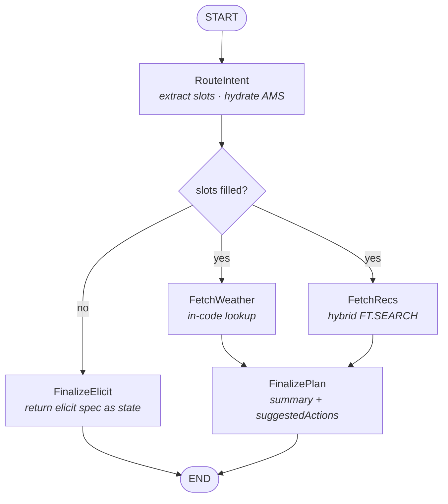
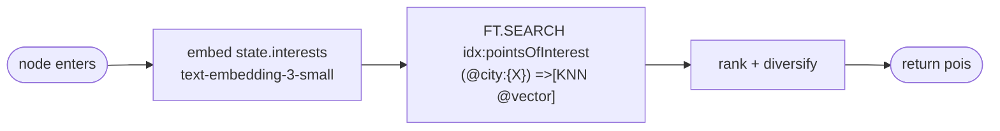

# Canonical graph sketch

Source-of-truth Mermaid for the new single-graph topology. The other diagrams elaborate on this.

## Top level

Each graph run is one-shot — no checkpointer, no `interrupt()`. When slots are missing, `FinalizeElicit` returns `{ elicit: { message, requestedSchema } }` as final state; the client renders a chip card and resubmits a new turn with the merged state.

## FetchRecs internal

The POI catalog was populated once by `scripts/seed-pois.ts` — Google Places API at seed time only. Runtime never calls Places.
