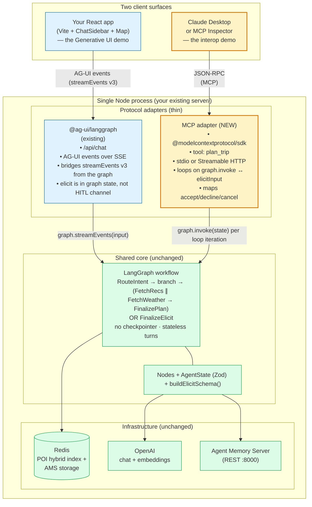
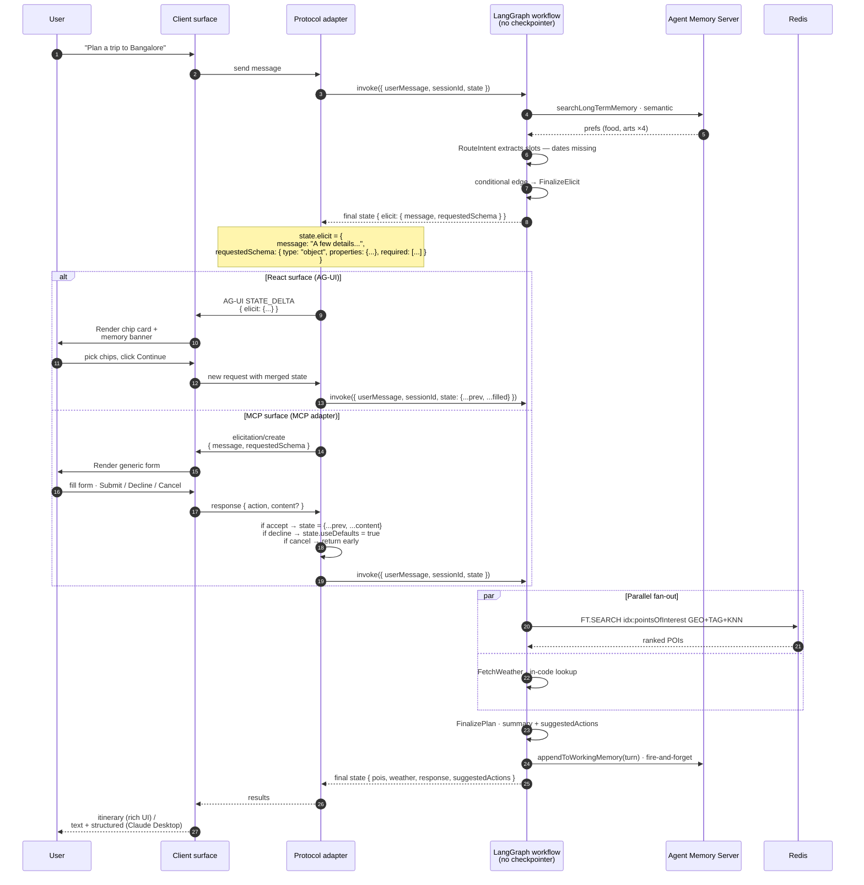

## Protocol architecture diagram

## Protocol sequence diagram — stateless turns

The key shape: **same graph, different adapter loop.** The React side and the MCP side both call `graph.invoke()` with state, get back either `{ elicit }` or `{ pois, weather, response, ... }`, and re-invoke if needed. No `interrupt()`, no checkpointer, no resume mechanic. The pause/resume of MCP elicitation lives at the *MCP SDK layer*, not the LangGraph layer.
