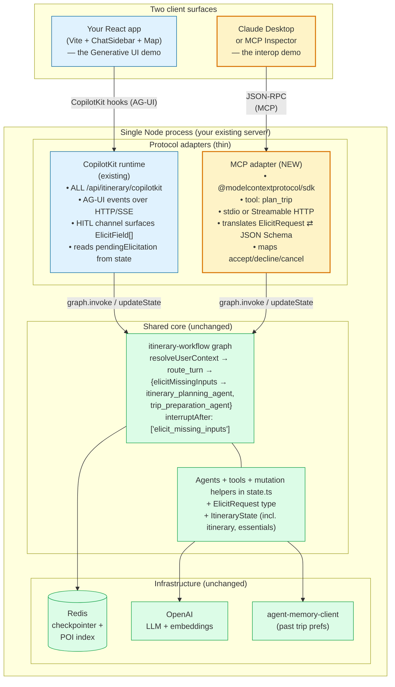
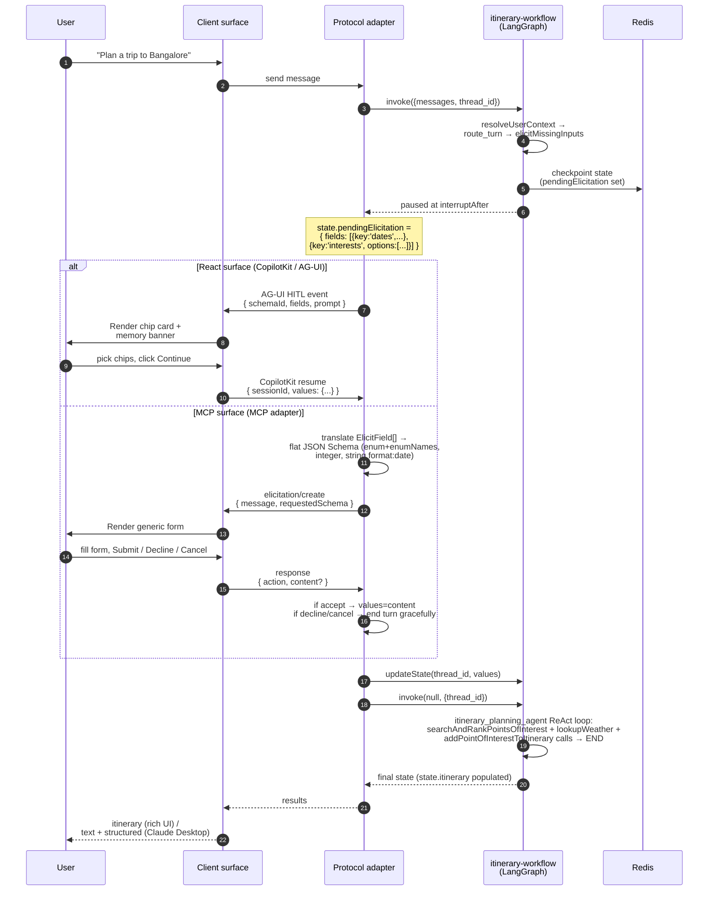

## Protocol architecture diagram

```mermaid
flowchart TB
      subgraph Clients["Two client surfaces"]
          direction LR
          React["Your React app<br/>(Vite + ChatSidebar + Map)<br/>— the Generative UI demo"]
          Claude["Claude Desktop<br/>or MCP Inspector<br/>— the interop demo"]
      end

      subgraph Server["Single Node process (your existing server/)"]
          direction TB
          subgraph Adapters["Protocol adapters (thin)"]
              direction LR
              AGUI["CopilotKit runtime<br/>(existing)<br/>• ALL /api/itinerary/copilotkit<br/>• AG-UI events over HTTP/SSE<br/>• HITL channel surfaces ElicitField[]<br/>• reads pendingElicitation from state"]
              MCP["MCP adapter (NEW)<br/>• @modelcontextprotocol/sdk<br/>• tool: plan_trip<br/>• stdio or Streamable HTTP<br/>• translates ElicitRequest ⇄ JSON Schema<br/>• maps accept/decline/cancel"]
          end

          subgraph Core["Shared core (unchanged)"]
              direction TB
              Graph["itinerary-workflow graph<br/>resolveUserContext → route_turn →<br/>{elicitMissingInputs → itinerary_planning_agent,<br/> trip_preparation_agent}<br/>interruptAfter: ['elicit_missing_inputs']"]
              Nodes["Agents + tools + mutation helpers in state.ts<br/>+ ElicitRequest type<br/>+ ItineraryState (incl. itinerary, essentials)"]
              Graph --- Nodes
          end

          subgraph Infra["Infrastructure (unchanged)"]
              direction LR
              Redis[("Redis<br/>checkpointer +<br/>POI index")]
              LLM["OpenAI<br/>LLM + embeddings"]
              Mem["agent-memory-client<br/>(past trip prefs)"]
          end
      end
      React -- "CopilotKit hooks (AG-UI)" --> AGUI
      Claude -- "JSON-RPC<br/>(MCP)" --> MCP
      AGUI -- "graph.invoke / updateState" --> Graph
      MCP  -- "graph.invoke / updateState" --> Graph
      Graph --> Redis
      Nodes --> LLM
      Nodes --> Mem

      classDef new fill:#fef3c7,stroke:#d97706,stroke-width:2px
      classDef existing fill:#e0f2fe,stroke:#0369a1
      classDef shared fill:#dcfce7,stroke:#16a34a
      class MCP,Claude new
      class AGUI,React existing
      class Graph,Nodes,Redis,LLM,Mem shared
```

## Protocol sequence diagram

```mermaid
sequenceDiagram
      autonumber
      participant User
      participant Surface as Client surface
      participant Adapter as Protocol adapter
      participant Graph as itinerary-workflow<br/>(LangGraph)
      participant Redis
      User->>Surface: "Plan a trip to Bangalore"
      Surface->>Adapter: send message
      Adapter->>Graph: invoke({messages, thread_id})
      Graph->>Graph: resolveUserContext →<br/>route_turn → elicitMissingInputs
      Graph->>Redis: checkpoint state<br/>(pendingElicitation set)
      Graph-->>Adapter: paused at interruptAfter

      Note over Adapter: state.pendingElicitation =<br/>{ fields: [{key:'dates',...},<br/>           {key:'interests', options:[...]}] }

      alt React surface (CopilotKit / AG-UI)
          Adapter->>Surface: AG-UI HITL event<br/>{ schemaId, fields, prompt }
          Surface->>User: Render chip card +<br/>memory banner
          User->>Surface: pick chips, click Continue
          Surface->>Adapter: CopilotKit resume<br/>{ sessionId, values: {...} }
      else MCP surface (MCP adapter)
          Adapter->>Adapter: translate ElicitField[] →<br/>flat JSON Schema (enum+enumNames,<br/>integer, string format:date)
          Adapter->>Surface: elicitation/create<br/>{ message, requestedSchema }
          Surface->>User: Render generic form
          User->>Surface: fill form, Submit / Decline / Cancel
          Surface->>Adapter: response<br/>{ action, content? }
          Adapter->>Adapter: if accept → values=content<br/>if decline/cancel → end turn gracefully
      end

      Adapter->>Graph: updateState(thread_id, values)
      Adapter->>Graph: invoke(null, {thread_id})
      Graph->>Graph: itinerary_planning_agent ReAct loop:<br/>searchAndRankPointsOfInterest + lookupWeather +<br/>addPointOfInterestToItinerary calls → END
      Graph-->>Adapter: final state (state.itinerary populated)
      Adapter-->>Surface: results
      Surface-->>User: itinerary (rich UI) /<br/>text + structured (Claude Desktop)
```