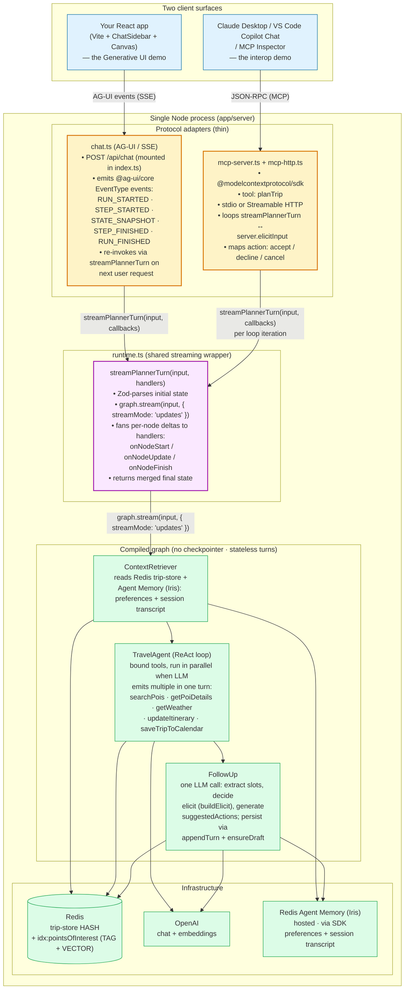

## Protocol architecture diagram

Two client surfaces, one graph, and a shared streaming wrapper (`streamPlannerTurn` in `runtime.ts`) between them. Verified against the current source: `graph.ts`, `runtime.ts`, `chat.ts`, `mcp-server.ts`, `state.ts`, `places-repository.ts`, `user-service.ts`.



The shape: **same compiled graph + same streaming wrapper, different transport adapters.** Neither adapter calls `graph.invoke` or `graph.stream` directly — both go through `streamPlannerTurn` in `runtime.ts`, which streams `graph.stream(..., { streamMode: 'updates' })` and fans per-node deltas out to whatever callbacks the adapter passes. The pause/resume of MCP elicitation lives at the **MCP SDK layer** (`server.elicitInput()` in the adapter), not the graph or runtime layer. No `interrupt()`, no checkpointer.

## Protocol sequence diagram — stateless turns

```mermaid
sequenceDiagram
      autonumber
      participant User
      participant Surface as Client surface
      participant Adapter as Protocol adapter
      participant Runtime as runtime.ts<br/>(streamPlannerTurn)
      participant Graph as Graph<br/>(CR → TA → FU)
      participant AMS as Agent Memory (Iris)
      participant Redis

      User->>Surface: "Plan a trip to Bangalore"
      Surface->>Adapter: send message
      Adapter->>Runtime: streamPlannerTurn({ userId, tripId, userMessage, state })
      Runtime->>Graph: graph.stream(input, { streamMode: 'updates' })

      rect rgba(0,0,0,0.04)
          Note over Graph: ContextRetriever (single read point at graph entry)
          Graph->>AMS: getPreferences(userId) · getConversation(tripId)
          AMS-->>Graph: prefs (e.g. recurringInterests=[food, arts])
          Graph->>Redis: getTrip(userId, tripId)
          Redis-->>Graph: trip draft
      end

      rect rgba(0,0,0,0.04)
          Note over Graph: TravelAgent (ReAct loop with bound tools)
          par tool calls emitted in parallel by the LLM in one turn
              Graph->>Redis: searchPois · FT.SEARCH idx:pointsOfInterest<br/>(@city:{X}) =>[KNN k @vector $qv AS score]<br/>(city TAG filter + KNN; no GEO filter at runtime)
              Redis-->>Graph: ranked POIs
          and
              Graph->>Graph: getWeather · in-code city/month lookup<br/>(weather-repository.ts, no API call)
          end
      end

      rect rgba(0,0,0,0.04)
          Note over Graph: FollowUp — extract slots, decide elicit, generate suggestions
          alt missing required slots (destination / dates / interests)
              Graph-->>Runtime: final state delta { elicit: { mode, message, requestedSchema }, response }
              Runtime-->>Adapter: onNodeUpdate('FollowUp', delta) → onFinish(finalState)
          else slots all satisfied
              Graph->>AMS: appendTurn(tripId, turn) · awaited
              Graph->>Redis: ensureDraft(userId, tripId, …)
              Graph-->>Runtime: final state delta { pois, weather, response, suggestedActions }
              Runtime-->>Adapter: onNodeUpdate(...) → onFinish(finalState)
          end
      end

      alt React surface (AG-UI · chat.ts)
          Note over Adapter: handlers map runtime callbacks to @ag-ui/core EventType:<br/>onStart → RUN_STARTED<br/>onNodeStart → STEP_STARTED<br/>onNodeUpdate(delta) → STATE_SNAPSHOT(snapshot: delta)<br/>onNodeFinish → STEP_FINISHED<br/>onFinish → RUN_FINISHED
          Adapter->>Surface: SSE: STATE_SNAPSHOT { elicit | pois | weather | response | suggestedActions }
          opt elicit was returned
              Surface->>User: render chip card from requestedSchema<br/>(memory-prefilled chips where applicable)
              User->>Surface: pick chips, click Continue
              Surface->>Adapter: new HTTP request with merged client state
              Adapter->>Runtime: streamPlannerTurn({ userMessage, tripId, state: {...prev, ...filled} })
          end
      else MCP surface (mcp-server.ts)
          opt elicit was returned · form mode
              Adapter->>Surface: server.elicitInput({ mode: "form", message, requestedSchema })
              Surface->>User: render generic form
              User->>Surface: fill form · Accept / Decline / Cancel
              Surface->>Adapter: reply { action, content? }
              Adapter->>Adapter: if accept → state = {...prev, ...content}, userDeclinedElicit: false<br/>if decline → state = {...prev}, userDeclinedElicit: true<br/>if cancel → return early without re-invoking
              Adapter->>Runtime: streamPlannerTurn({ userMessage, tripId, state })
          end
          opt elicit was returned · url mode (saveTripToCalendar / OAuth)
              Adapter->>Surface: server.elicitInput({ mode: "url", url, elicitationId, message })
              Surface->>User: open OAuth URL in browser
              User->>User: authorize on Google
              Note over Adapter: callback resolves the deferred keyed by elicitationId;<br/>then completionNotifier fires
              Adapter->>Runtime: streamPlannerTurn with same userMessage, state.elicit cleared
          end
      end

      Adapter-->>Surface: final results
      Surface-->>User: rich UI (React) /<br/>structured content (MCP host)
```

The key properties this diagram captures:

- **One compiled graph, both transports.** `ContextRetriever → TravelAgent → FollowUp`. Linear, three nodes, no branching at the graph level. No checkpointer.
- **Both adapters go through `streamPlannerTurn` (runtime.ts).** Not `graph.invoke` directly. The runtime wraps `graph.stream({ streamMode: 'updates' })` and fans per-node deltas via callbacks the adapter supplies. AG-UI maps those callbacks to `@ag-ui/core` `EventType` events; MCP maps them to its own progress + result shapes.
- **Parallelism lives inside `TravelAgent`**, not in the graph topology. The LLM is system-prompted to emit multiple tool calls in a single ReAct turn (e.g. `searchPois` + `getWeather`), and the agent runtime runs them in parallel.
- **Elicit is a state field**, not a HITL channel. `FollowUp` returns `state.elicit = { mode, message, requestedSchema }` and the graph ends. The adapter is responsible for the round-trip: AG-UI emits a `STATE_SNAPSHOT` and waits for the next client request; MCP calls `server.elicitInput()` and re-invokes the planner inline.
- **Two elicit modes.**
  - *Form mode* — used by `FollowUp` for chip-card disambiguation / missing-slot composition. MCP merges `reply.content` into state on accept; sets `userDeclinedElicit: true` on decline; returns early on cancel.
  - *URL mode* — used by `saveTripToCalendar` for Google OAuth. The tool returns a URL + `elicitationId`; the MCP adapter pairs that with a `completionNotifier` keyed on the same id, awaits the OAuth callback, then re-invokes the planner with `state.elicit = undefined`.
- **Three response actions on MCP.** `accept` merges typed content; `decline` sets `userDeclinedElicit` so `FollowUp` proceeds without re-eliciting the same slots; `cancel` returns early without continuing the loop.
- **POI search is `TAG + KNN`**, not `GEO + TAG + KNN`. The `location` field is GEO-indexed but never queried with a GEO filter at runtime (verified in `places-repository.ts:73`).
- **`getWeather` is an in-code lookup**, not an API call (`weather-repository.ts`).
