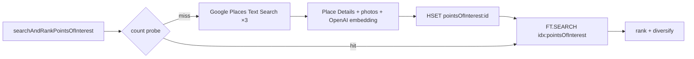

# Redis Data Model

Reference for how every piece of state in the demo lives in Redis. One Redis Stack instance, three logical namespaces:

| Namespace | Purpose | Owner |
|---|---|---|
| `idx:pointsOfInterest` + `pointsOfInterest:{placeId}` | Hybrid search index over enriched places | `searchAndRankPointsOfInterest` tool |
| RedisSaver checkpoint keys | LangGraph session state (full trip data) | LangGraph nodes + mutation helpers in `itinerary-workflow/state.ts` |
| Agent Memory Server keys (own prefix) | Working memory + long-term semantic/episodic | AMS service |

The three namespaces share one Redis instance but never read each other's keys directly. The boundary is a service contract, not a data layout.

---

## 1. Points-of-interest hybrid index

**Key shape**: `pointsOfInterest:{placeId}` (HASH, one per Google Place result)
**Index**: `FT.CREATE idx:pointsOfInterest ON HASH PREFIX 1 pointsOfInterest:`
**TTL**: 7 days per hash. The index entry disappears with the hash.

### Schema

| Field | Type | Notes |
|---|---|---|
| `location` | GEO | `"longitude,latitude"` — for radius filter |
| `types` | TAG (sep `\|`) | Google Place types — `museum`, `restaurant`, `cafe`, … |
| `rating` | NUMERIC | Google rating 1–5 |
| `name` | TEXT | Display name |
| `description` | TEXT | Synthesised summary (Place Details + photos) |
| `vector` | VECTOR | HNSW · COSINE · 1536d (`text-embedding-3-small` over `name + description + types`) |

### Access patterns

- **Cache-check (abundance gate)** — `FT.SEARCH idx:pointsOfInterest "@location:[lon lat radius km]" LIMIT 0 0`. Pure count probe over the destination's geo radius; below threshold means cold and the tool falls through to Google Places.
- **Hybrid retrieval** — `FT.SEARCH idx:pointsOfInterest "(@location:[lon lat radius km] @types:{food|culture})=>[KNN $k @vector $query_vec AS score]" PARAMS 2 query_vec <buf> RETURN 1 score DIALECT 2 SORTBY score ASC`. GEO + TAG filter AND KNN in one round-trip.
- **Cache write** — `HSET pointsOfInterest:{placeId} <fields…>` then `EXPIRE pointsOfInterest:{placeId} 604800` on every enriched result before ranking.

### Lifecycle



---

## 2. LangGraph session checkpoints (RedisSaver)

**Owner**: `@langchain/langgraph-checkpoint-redis` — opaque key layout, indexed per `thread_id` (= our `sessionId`). One checkpoint per turn, plus pending writes.

This is where **trip data lives**. Anything in `ItineraryState` round-trips through RedisSaver. The agents and the REST routes both write here via the mutation helpers in `itinerary-workflow/state.ts`; nothing else does.

### State slices stored in the checkpoint

| Slice | Type | Written by | Reducer |
|---|---|---|---|
| `userId`, `sessionId` | scalar | init | overwrite |
| `messages` | `BaseMessage[]` | CopilotKit adapter, agents | `messagesStateReducer` (append) |
| `destination`, `dates`, `budget`, `groupSize` | scalar | `elicit_missing_inputs` | overwrite |
| `interests` | `string[]` | `elicit_missing_inputs` (every turn) | overwrite |
| `weather` | `Weather` | `lookupWeather` tool | overwrite |
| **`itinerary`** | `ItineraryDay[]` (see shape below) | `add/removePointOfInterestToItinerary` tools + `/api/itinerary/:threadId/entries` REST | overwrite (R-M-W in `state.ts`) |
| **`tripEssentials`** | `Record<essentialId, TripEssential>` (see shape below) | `add/removeItemToTripEssentials` tools + `/api/itinerary/:threadId/tripEssentials/:essentialId` REST | overwrite (R-M-W in `state.ts`) |
| `prefilledFromMemory` | `string[]` (UI badge signal — see below) | `resolve_user_context` | overwrite (cleared on resume) |
| `pendingElicitation` | `ElicitRequest` | `elicit_missing_inputs` | overwrite (cleared on resume) |

### Shapes — `itinerary` and `tripEssentials`

```ts
// state.itinerary  -- the composed day-by-day plan
type TimeOfDay = 'morning' | 'afternoon' | 'evening' | 'meal';

interface ItineraryPointOfInterest {
    id: string;                   // entry id — React key + explicit remove target
    timeOfDay: TimeOfDay;
    pointOfInterestId: string;    // FK → pointsOfInterest:{placeId} hash
    pointOfInterestName: string;  // denormalised — survives the 7-day index TTL
    note?: string;                // optional agent commentary ("good for sunset")
}

interface ItineraryDay {
    dayId: string;                          // "day-1", "day-2", … (ordering is implicit in array index)
    date?: string;                          // YYYY-MM-DD if dates are known
    entries: ItineraryPointOfInterest[];
}

// state.tripEssentials  -- packing + pre-trip items
interface TripEssential {
    id: string;                 // "umbrella", "passport", "powerBank" …
    label: string;              // display string
    owned: boolean;             // checkbox state (false = still needs to acquire)
    productId?: string;         // if searchProducts surfaced a buy suggestion
}
```

Neither slice uses a custom reducer — both channels are last-write-wins. All add/remove logic lives in the read-modify-write helpers in `itinerary-workflow/state.ts` (`pinPointOfInterest` / `unpinPointOfInterest` / `markTripEssential` / `unmarkTripEssential`). Each helper snapshots the current value, applies the change in-process, and writes the new full value back via `graph.updateState`. Dedupe on `pinPointOfInterest` is by `(dayId, timeOfDay, pointOfInterestId)` — a UI click and an agent tool call that both add the Louvre to day-1 morning collapse into one entry. The surrogate `id` exists so the UI can React-key and so explicit removes (`removePointOfInterestFromItinerary(entryId)`) target one slot even when the same POI legitimately appears twice (e.g. lunch + dinner at different restaurants on the same day).

Storing `pointOfInterestName` redundantly costs a few bytes per entry but is what makes "load past trip" still render readable cards after the 7-day `pointsOfInterest:{placeId}` TTL has elapsed. The richer fields (photos, rating, vector) are fetched lazily from the index when present, and we degrade gracefully to a name-only card when they're not.

### Why `prefilledFromMemory` exists

It's a small UI-affordance signal, not data the agent reasons over. When `resolve_user_context` projects values from AMS into typed slots (`interests`, `budget`, `groupSize`), it records which slot names were memory-sourced. The `elicit_missing_inputs` node forwards that list to the client as `prefilledFromMemory: true` on the matching `ElicitField`, and `InlineVariableChips.tsx` renders a small history icon next to the label so the user knows *"we remembered this from a past trip — change it if you want"*. Without the flag the user can't distinguish auto-filled chip values from values they typed this turn. Cleared on resume so it doesn't badge fields on subsequent turns.

### What does **not** live in the checkpoint

- Enriched POI records (`name`, `description`, `vector`, `rating`, photos) — those are pulled from `pointsOfInterest:{placeId}` on demand. The checkpoint only stores `pointOfInterestId` references inside `state.itinerary`.
- User preferences and habits — those live in AMS.
- Product catalogue results from `searchProducts` — surfaced once, stored as `productId` references inside `state.tripEssentials[id].productId`.

### "Load past trip" flow

The memory drawer calls `POST /api/user/load-trip` with a `tripId`. The handler resolves `tripId → sessionId` (from AMS episodic), then RedisSaver rehydrates the full `ItineraryState` for that `sessionId`. The UI re-renders both the chat transcript and the canvas (itinerary + tripEssentials) from that single state object.

---

## 3. Agent Memory Server (AMS)

Separate service, separate key prefix, same Redis instance. AMS owns its own schema; the demo only talks to it through its HTTP API (`config.agentMemoryServer.url`).

| Tier | What it stores | When written | When read |
|---|---|---|---|
| **Working memory** | Per-session conversation buffer | AMS auto-ingests AG-UI messages | `resolve_user_context` (recent context) |
| **Long-term · semantic** | Vectorised preferences/habits extracted from past conversations (e.g. *"always packs a power bank"*, *"prefers indie cafés"*) | AMS extraction job over working memory | `resolve_user_context` → projects into `state.interests`, `state.budget`, `state.groupSize`, and the trip-preparation agent's prompt |
| **Long-term · episodic** | Trip records — `{ sessionId, destination, dates, … }` | At end-of-trip or when explicitly persisted | memory drawer's "past trips" list (loaded via `getUserPastTrips`) |

### Critical boundary

**The mutation tools never write to AMS.** `addItemToTripEssentials` writes to `state.tripEssentials` (in the checkpoint). AMS observes the resulting *conversation* — "I added a power bank" — through its working-memory ingestion, and its extraction job decides whether that's a stable preference worth promoting to long-term semantic memory. The demo code does not call AMS's long-term write APIs directly.

---

## Summary cheatsheet

```
pointsOfInterest:{placeId}   →  HASH       — enriched place + embedding (7d TTL)
idx:pointsOfInterest         →  FT index   — hybrid GEO + TAG + KNN

checkpoint:{sessionId}:*     →  RedisSaver — full ItineraryState (incl. itinerary, essentials)

ams:*                        →  AMS-owned  — working buffer + long-term semantic + episodic
```

One instance, three contracts. Trip data is in the checkpoint, place catalogue is in the index, cross-session memory is in AMS — and the only bridge between them is `resolve_user_context` reading AMS at turn start.
