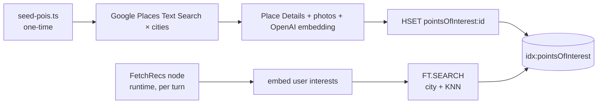

# Redis Data Model

Reference for how Redis stores data in the demo. One Redis Stack instance, two logical namespaces:

| Namespace | Purpose | Owner |
|---|---|---|
| `idx:pointsOfInterest` + `pointsOfInterest:{placeId}` | Hybrid search index over enriched places | seed script (writes) + `FetchRecs` node (reads) |
| Agent Memory Server keys (own prefix) | Working memory (conversation) + long-term semantic + long-term episodic | AMS service |

The two namespaces share one Redis instance but never read each other's keys directly. The boundary is a service contract, not a data layout.

---

## 1. Points-of-interest hybrid index

**Key shape**: `pointsOfInterest:{placeId}` (HASH, one per Google Place result)
**Index**: `FT.CREATE idx:pointsOfInterest ON HASH PREFIX 1 pointsOfInterest:`
**Lifetime**: durable — populated once by the seed script, no TTL. Re-run `npm run seed:pois` to refresh.

### Schema

| Field | Type | Notes |
|---|---|---|
| `city` | TAG | `Bangalore`, `Mumbai`, `Barcelona` — primary filter |
| `location` | GEO | `"longitude,latitude"` — used for proximity sort if needed |
| `types` | TAG (sep `\|`) | Google Place types — `museum`, `restaurant`, `cafe`, … |
| `rating` | NUMERIC | Google rating 1–5 |
| `name` | TEXT | Display name |
| `description` | TEXT | Synthesised summary (Place Details + photos) |
| `vector` | VECTOR | HNSW · COSINE · 1536d (`text-embedding-3-small` over `name + description + types`) |

### Access patterns

- **Hybrid retrieval** (runtime, every turn) — `FT.SEARCH idx:pointsOfInterest "(@city:{Bangalore})=>[KNN $k @vector $query_vec AS score]" PARAMS 2 query_vec <buf> RETURN 1 score DIALECT 2 SORTBY score ASC`. City TAG filter AND KNN over the interests embedding in one round-trip.
- **Seed write** (seed time only) — `HSET pointsOfInterest:{placeId} <fields…>` for each Google Place result; no `EXPIRE`.

### Lifecycle



---

## 2. Agent Memory Server (AMS)

Separate service, separate key prefix, same Redis instance. AMS owns its own schema; the demo only talks to it through its HTTP API (`config.agentMemoryServer.url`).

| Tier | What it stores | When written | When read |
|---|---|---|---|
| **Working memory** | Per-session conversation transcript. Auto-summarized when long. | `Finalize*` nodes append the turn (fire-and-forget) | `RouteIntent` (recent context) |
| **Long-term · semantic** | Vectorised preferences/habits extracted from past conversations (e.g. *"always packs a power bank"*, *"prefers indie cafés"*) | AMS extraction job over working memory | `RouteIntent` → projects into `state.preferences` (budget, group size, recurring interests) |
| **Long-term · episodic** | Trip records — `{ sessionId, destination, dates, summary }` | At end-of-session or when explicitly persisted via `/api/user/save-trip` | memory drawer's "Past trips" list, "Load past trip" rehydrate |

### Critical boundary

The graph never persists trip state in AMS as raw fields. AMS observes the *conversation* through its working-memory ingestion, and its extraction job decides whether a fact is a stable preference worth promoting to long-term semantic memory. The trip itself becomes an episodic record via an explicit save call at end-of-session.

### "Load past trip" flow

The memory drawer calls `POST /api/user/load-trip` with a `tripId`. The handler fetches the AMS episodic record + the session's working-memory transcript and returns both to the client. The UI re-renders both the chat transcript and the canvas (POIs, itinerary) from that single payload. No LangGraph checkpoint involved — the graph has no notion of "loading a past run" because there's no checkpointer.

### Why no LangGraph checkpointer

Earlier designs used `RedisSaver` to persist graph state per `thread_id` for the `interrupt()`/resume mechanic that paused mid-elicitation. The current design returns elicit specs as final state instead of pausing the graph — so each graph run is one-shot, state lives on the client between turns, and there's nothing to checkpoint. AMS is the single source of truth for conversation history.

---

## Summary cheatsheet

```
pointsOfInterest:{placeId}   →  HASH       — enriched place + embedding (durable; re-seed to refresh)
idx:pointsOfInterest         →  FT index   — hybrid city TAG + KNN over vector

ams:*                        →  AMS-owned  — working memory (conversation) + long-term semantic + long-term episodic
```

One instance, two contracts. POI catalogue is in the hybrid index, cross-session memory + conversation is in AMS — and the only bridge between them is `RouteIntent` reading AMS at turn start.
