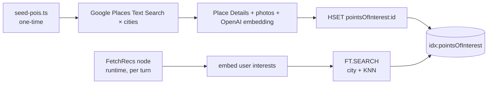

# Redis Data Model

Reference for how the demo stores data. Redis holds the POI catalogue and trip records; memory lives in the **Redis Agent Memory (Iris)** hosted service, reached over HTTP via the `@redis-iris/agent-memory` SDK — not in this Redis instance.

| Store | Purpose | Owner |
|---|---|---|
| `idx:pointsOfInterest` + `pointsOfInterest:{placeId}` | Hybrid search index over enriched places | seed script (writes) + `searchPois` tool (reads) |
| `user:{userId}:trip:{tripId}` | Trip records — destination, dates, interests, picked places, status | `trips-repository` (Redis HASH) |
| Agent Memory (Iris) | Session transcript + long-term facts | hosted service, via `@redis-iris/agent-memory` |

---

## 1. Points-of-interest hybrid index

**Key shape**: `pointsOfInterest:{placeId}` (HASH, one per Google Place result)
**Index**: `FT.CREATE idx:pointsOfInterest ON HASH PREFIX 1 pointsOfInterest:`
**Lifetime**: durable — populated once by the seed script, no TTL. Re-run `npm run seed:pois` to refresh.

### Schema

| Field | Type | Notes |
|---|---|---|
| `city` | TAG | `Bangalore`, `Mumbai`, `Barcelona` — primary filter |
| `location` | GEO | `"longitude,latitude"` — used for proximity sort if needed |
| `types` | TAG (sep `\|`) | Google Place types — `museum`, `restaurant`, `cafe`, … |
| `rating` | NUMERIC | Google rating 1–5 |
| `name` | TEXT | Display name |
| `description` | TEXT | Synthesised summary (Place Details + photos) |
| `vector` | VECTOR | HNSW · COSINE · 1536d (`text-embedding-3-small` over `name + description + types`) |

### Access patterns

- **Hybrid retrieval** (runtime, every turn) — `FT.SEARCH idx:pointsOfInterest "(@city:{Bangalore})=>[KNN $k @vector $query_vec AS score]" PARAMS 2 query_vec <buf> RETURN 1 score DIALECT 2 SORTBY score ASC`. City TAG filter AND KNN over the interests embedding in one round-trip.
- **Seed write** (seed time only) — `HSET pointsOfInterest:{placeId} <fields…>` for each Google Place result; no `EXPIRE`.

### Lifecycle



---

## 2. Agent Memory (Iris)

A hosted service reached through the `@redis-iris/agent-memory` SDK (`serverURL` + `storeId` + bearer `apiKey`). Not part of this Redis instance — the demo talks to it only through the SDK. Two stores, mapped from our domain concepts:

| Store | What it holds | Domain mapping | Written | Read |
|---|---|---|---|---|
| **Session (working memory)** | Verbatim conversation events, ordered by ingestion | session = `tripId`, actor = `userId` | `followUp` → `appendTurn`, one `addSessionEvent` per message (awaited) | `contextRetriever` → `state.conversationHistory` |
| **Long-term memory** | Facts + trip-history summaries, categorized by `topics` | `ownerId` = `userId` | seed script + `archiveTripToMemory` → `bulkCreateLongTermMemories` | `contextRetriever` → `state.preferences` via `searchLongTermMemory` |

### Scoping

- The **transcript** is one session per trip. `getSessionMemory(tripId)` returns events in order; the server keeps event order, so no client-side sequencing is needed. `deleteSessionMemory(tripId)` clears it on Reset.
- **Preferences** search filters `ownerId = userId` AND `topics ∈ {travel_preferences, interests, budget}` (`filterOp: 'all'`), which keeps `trip_history` records out of the preference roll-up.
- Long-term records use **deterministic ids** (`<userId>:pref:<n>`, `<userId>:trip:<tripId>`), so re-seeding overwrites rather than duplicating.

### "Load past trip" flow

The memory drawer calls `POST /api/user/load-trip` with a `tripId`. The handler reads the trip HASH from Redis plus that trip's session transcript from Agent Memory and returns both. The UI re-renders the chat transcript and the canvas from that single payload. No LangGraph checkpoint involved — the graph has no notion of "loading a past run" because there's no checkpointer.

### Why no LangGraph checkpointer

Earlier designs used `RedisSaver` to persist graph state per `thread_id` for the `interrupt()`/resume mechanic that paused mid-elicitation. The current design returns elicit specs as final state instead of pausing the graph — so each graph run is one-shot and there's nothing to checkpoint. Agent Memory is the single source of truth for conversation history.

---

## Summary cheatsheet

```
pointsOfInterest:{placeId}   →  Redis HASH     — enriched place + embedding (durable; re-seed to refresh)
idx:pointsOfInterest         →  Redis FT index — hybrid city TAG + KNN over vector
user:{id}:trip:{tripId}      →  Redis HASH     — trip record (draft or completed)

Agent Memory session=tripId  →  Iris (hosted)  — verbatim conversation events
Agent Memory ownerId=userId  →  Iris (hosted)  — long-term facts + trip history
```

Redis holds the catalogue and the trip; Agent Memory holds what the agent remembers. The bridge between them is `contextRetriever`, which reads both at the start of every turn.
